### Upper Section

UML 클래스 다이어그램에서 클래스는 보통 세 개의 수평 섹션으로 나누어집니다. 이 섹션들은 각각 클래스의 이름, 속성(Attributes), 메소드(Methods)를 나타냅니다. 그중 가장 위에 위치한 섹션을 **Upper Section**이라고 하며, 여기에는 클래스의 이름이 표시됩니다.  

**Upper Section의 역할**

1.  클래스 식별: Upper Section은 해당 클래스의 이름을 표시함으로써, 다이어그램에서 클래스를 식별할 수 있게 합니다. 이 이름은 클래스의 인스턴스가 가질 수 있는 객체 유형을 정의합니다.
2.  클래스 범주화: 이름을 통해 클래스가 어떤 종류의 객체들을 나타내는지 명확히 합니다. 예를 들어, “Dog”, “Student”, “Car”와 같은 이름은 각기 다른 범주의 객체들을 나타냅니다.
3.  시각적 식별: 다이어그램 상에서 다른 클래스들과 구별하기 쉽게 해주며, 복잡한 시스템에서도 클래스들을 쉽게 찾을 수 있게 돕습니다.

**디자인 관례**

-   클래스 이름은 대문자로 시작하는 카멜 케이스(CamelCase)를 사용하는 것이 일반적입니다. 예를 들어, "ShoppingCart", "UserProfile"과 같이 표기합니다.
-   Upper Section은 간결하고 명확하게 클래스의 이름만을 포함하며, 특별한 상황을 제외하고는 다른 정보는 포함하지 않습니다.  
    

이렇게 Upper Section을 통해 UML 다이어그램에서 클래스의 기본적인 식별 정보를 제공하며, 다이어그램을 읽는 사람들이 각 클래스가 무엇을 나타내는지 쉽게 파악할 수 있도록 합니다.
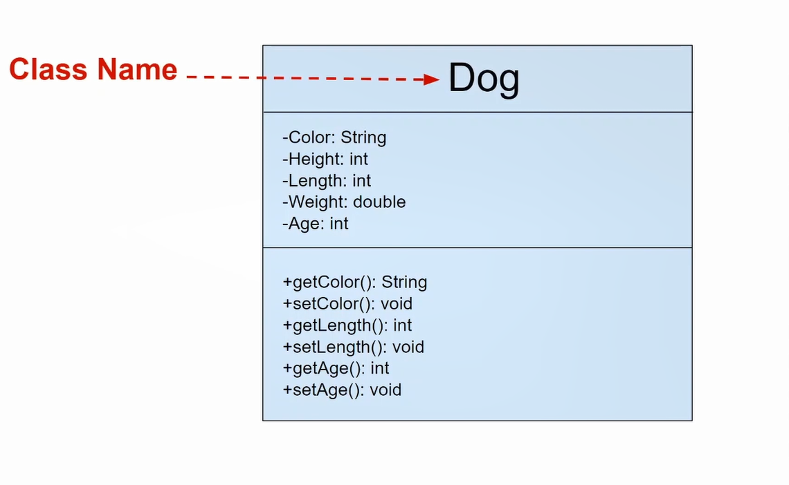

​
#### Middle Section
​
UML 클래스 다이어그램의 **Middle Section**은 클래스의 속성을 나열하는 부분으로, 속성은 클래스의 인스턴스가 가지는 데이터 필드를 의미합니다. 이 섹션은 객체의 상태를 정의하며, 각 속성에는 명시된 데이터 타입이 있어 객체가 저장하고 관리할 수 있는 정보의 유형을 표시합니다.  
​
**Middle Section의 주요 요소:**
​
1.  속성 이름: 각 속성의 이름을 명시합니다.
2.  데이터 타입: 속성이 저장할 수 있는 데이터의 종류를 나타냅니다. 일반적인 데이터 타입으로는 **String**, **int**, **double** 등이 있습니다.
3.  디폴트 값: 필요한 경우, 속성의 디폴트 값을 설정할 수 있습니다. 이는 객체가 생성될 때 해당 속성이 초기화되는 값을 제공합니다.
​
**역할과 기능:**
​
-   객체의 상태 정의: 속성들은 객체의 현재 상태를 기술하는 정보를 담고 있으며, 이 정보는 객체의 행동에 직접적인 영향을 미칩니다.
-   데이터 관리: 속성들은 클래스가 처리할 데이터를 구체적으로 명시함으로써, 객체가 어떤 정보를 관리하고 처리할 수 있는지를 정의합니다.  
    
-   타입 안정성 제공: 각 속성에 데이터 타입을 명시함으로써, 해당 데이터 타입에 맞는 값만을 속성에 할당할 수 있도록 합니다. 이는 데이터의 정확성과 프로그램의 안정성을 향상시킵니다.  
    
​
  
**디자인 관례:**  
속성을 표현할 때 일반적인 형식은 다음과 같습니다:
​
-   접근 제어자: 속성의 접근성을 제어합니다 (**+** for public, **\-** for private, **#** for protected).
-   이름: 속성의 이름을 나타냅니다.  
    
-   타입: 속성이 저장할 데이터의 타입을 나타냅니다.  
    
-   기본값: 선택적으로, 속성이 기본적으로 가질 값을 명시할 수 있습니다.  
    
​
**예시:**
​
-   \- name: String = "Unknown" — 이름을 저장하는 private 문자열 속성으로, 디폴트 값은 "Unknown"입니다.
-   \+ age: int — 나이를 저장하는 public 정수 속성  
    
-   \# studentID: String — 학생 ID를 저장하는 protected 문자열 속성
​
  
이렇게 Middle Section을 통해 클래스의 구조적인 특성과 데이터 관리 방식이 명확하게 드러나며, 개발자는 객체가 어떤 정보를 내포하고 있는지 쉽게 이해할 수 있습니다.

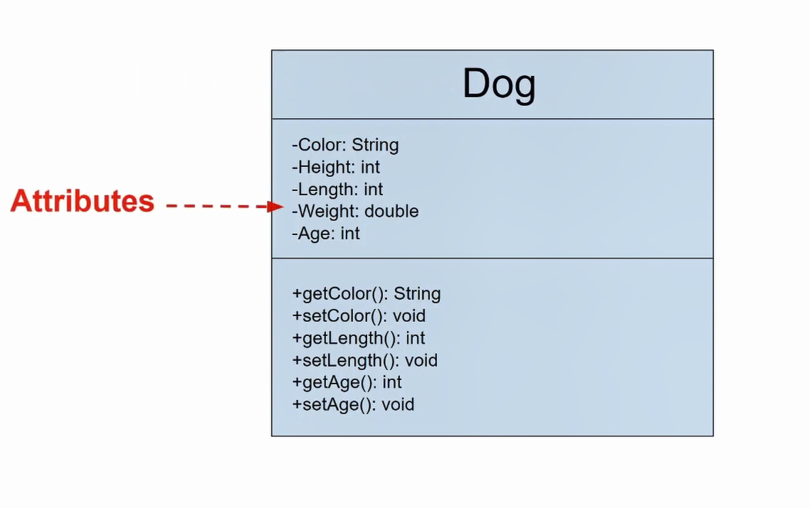
> Attributes 는 클래스의 인스턴스 변수로, 객체의 상태나 특징을 나타냅니다
캡슐화 할때 getter 나 setter 필드로 사용할 수 있습니다.

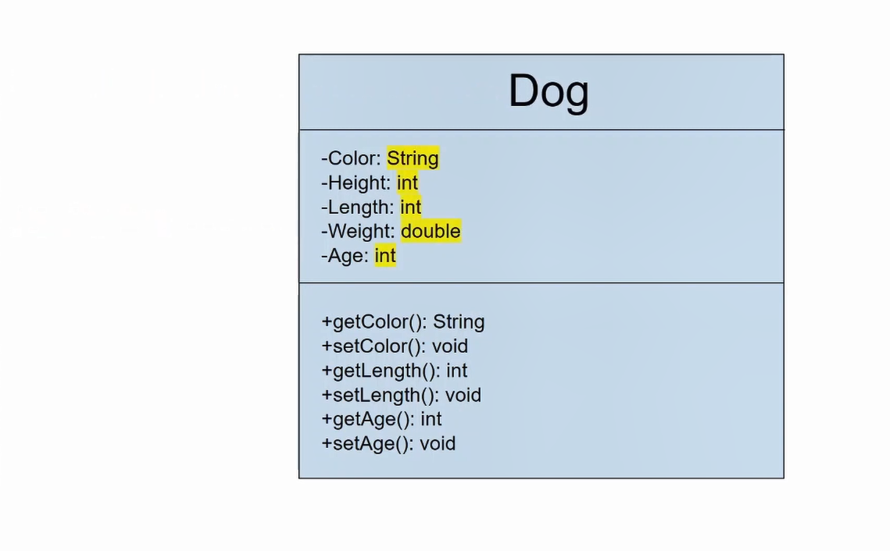

#### Lower Section
​
UML 클래스 다이어그램의 **Lower Section**은 클래스의 메소드(Methods)를 나열하는 부분입니다. 이 섹션은 클래스 인스턴스의 행동이나 기능을 정의하는 메소드를 포함하며, 객체가 수행할 수 있는 작업들을 나타냅니다.
​
**Lower Section의 주요 요소:**
​
1.  메소드 이름: 각 메소드의 이름을 명시합니다.
2.  파라미터: 메소드가 받아들이는 입력 값들을 나타냅니다. 파라미터는 괄호 안에 표시되며, 각 매개변수의 이름과 데이터 타입을 포함합니다.
3.  반환 타입\*\*: 메소드가 실행 후 반환하는 데이터의 타입을 명시합니다. 이는 메소드의 결과를 나타내며, 어떤 타입의 값을 반환할지를 지정합니다.
​
**역할과 기능:**
​
-   행동 정의: 메소드는 클래스의 행동을 정의합니다. 예를 들어, "Dog" 클래스의 bark() 메소드는 개가 짖는 행동을 구현할 수 있습니다.
-   상호작용 구현: 메소드는 클래스가 다른 객체나 시스템의 다른 부분과 상호작용하는 방식을 구현합니다. 이를 통해 객체 간의 커뮤니케이션 및 데이터 교환을 가능하게 합니다.
-   기능 제공: 객체가 수행할 수 있는 구체적인 작업이나 계산 등을 제공합니다. 이는 객체가 어떤 서비스나 기능을 외부에 제공할 때 중요합니다.
​
**디자인 관례:**
​
메소드를 표현할 때 일반적인 형식은 다음과 같습니다:
​
-   접근 제어자: 메소드의 접근성을 제어합니다 (**+** for public, **\-** for private, **#** for protected).
-   이름: 메소드의 이름을 나타냅니다.
-   매개변수: 메소드에 전달되는 인자의 타입과 이름을 포함합니다.
-   리턴 타입: 메소드가 실행 후 반환할 데이터의 타입을 명시합니다.
​
**예시:**
​
-   \+ bark(): void — 개가 짖는 행동을 수행하며, 반환 값이 없습니다 (void).
-   \+ eat(food: String): boolean — 개가 음식을 먹는 행동을 수행하며, 성공적으로 먹었는지 여부를 boolean 값으로 반환합니다.
-   \# calculateAgeInDogYears(): int — 개의 나이를 "개의 해"로 계산하여 정수로 반환합니다.
​
Lower Section을 통해 클래스의 객체가 어떤 작업을 수행할 수 있는지, 그리고 어떻게 다른 객체와 상호작용할 수 있는지 명확하게 이해할 수 있으며, 개발자는 이를 통해 객체의 행동을 적절하게 설계하고 구현할 수 있습니다.
​
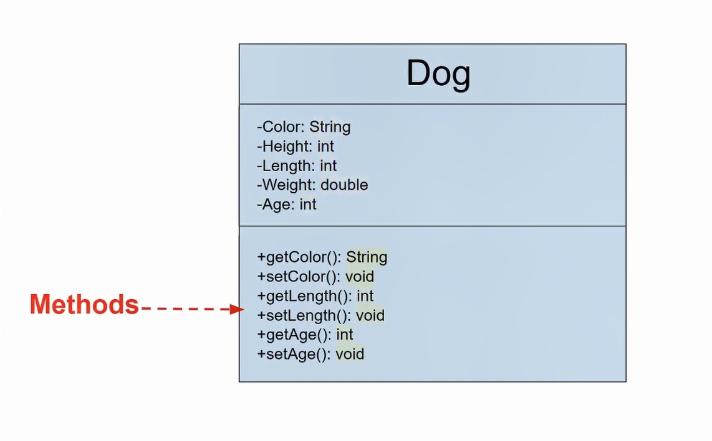
#### Return Type

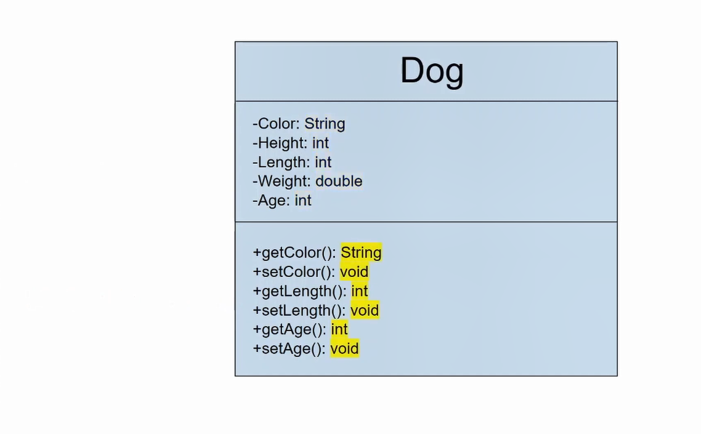

### Access Modifier

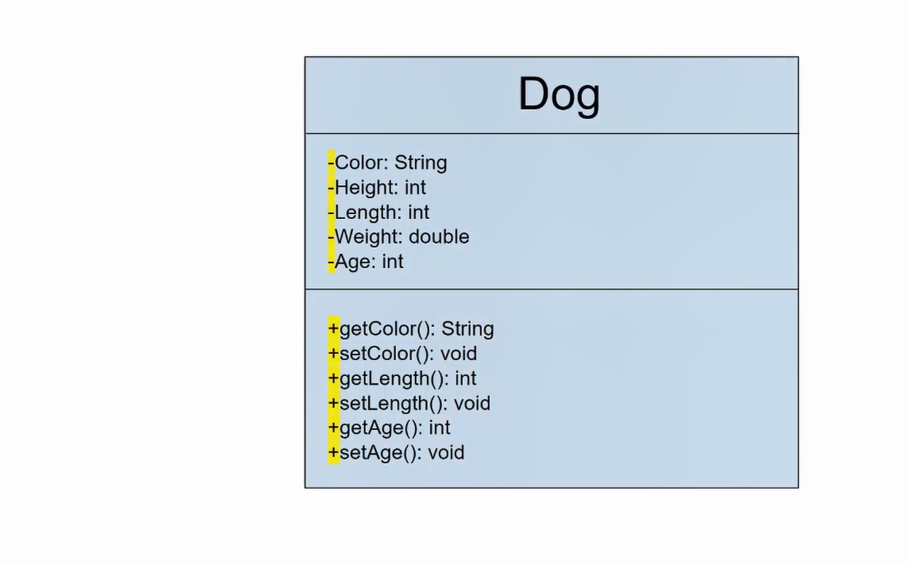
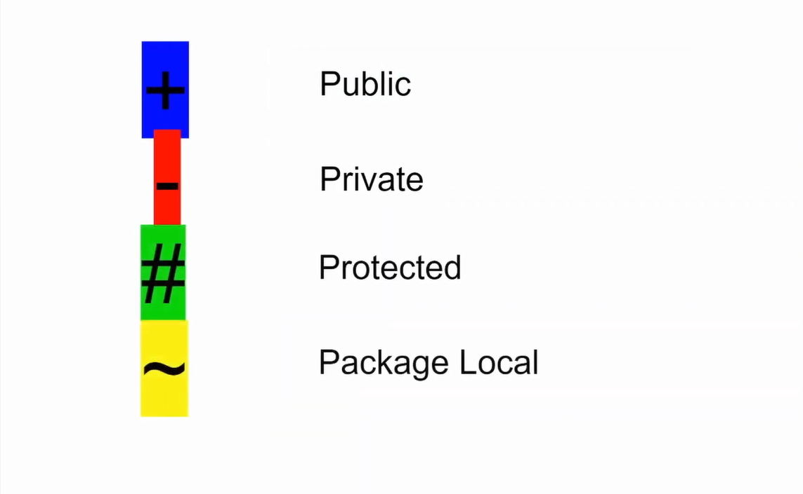

### Method Parameter Direction

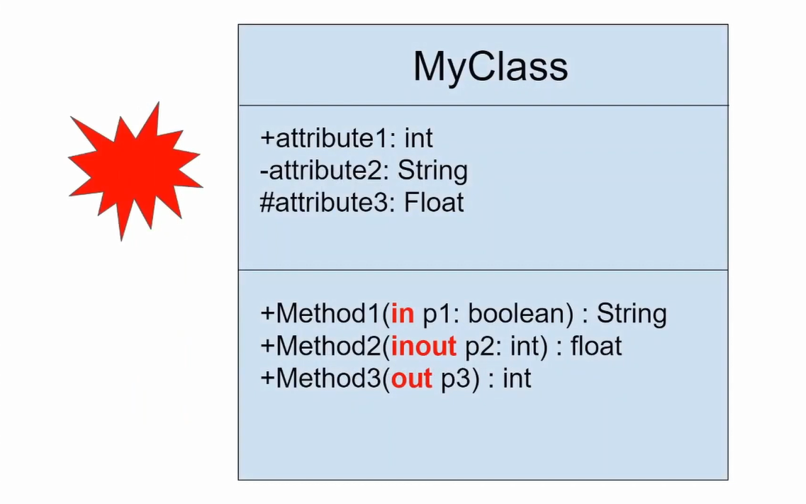

### Implementation Perspective

UML (Unified Modeling Language)에서 **Implementation Perspective**는 소프트웨어 개발 프로세스의 한 부분으로, 시스템의 실제 구현 단계와 관련된 요소들을 다룹니다. 이 관점은 소프트웨어가 설계 단계에서 어떻게 구체화되고 실제로 작동하는 코드로 변환되는지를 중점적으로 보여주는 데 사용됩니다.

#### Implementation Perspective의 주요 요소들

1.  코드 구현: 설계된 모델을 실제 프로그래밍 언어로 전환하는 과정입니다. 이것은 클래스 다이어그램에서 보여진 클래스들이 실제 코드 내에서 어떻게 정의되고 구현되는지를 포함합니다.
2.  컴포넌트 및 패키지: 시스템이 구성되는 더 큰 구조적 단위인 컴포넌트와 패키지를 모델링합니다. 이들은 코드의 물리적인 구성을 나타내며, 어떤 파일들이 어떻게 조직되어 있는지, 또 서로 어떻게 연결되어 있는지를 설명합니다.
3.  배포 다이어그램: 소프트웨어가 어떻게 다양한 하드웨어 리소스에 배포되는지를 보여주는 다이어그램입니다. 이는 실행 가능한 파일, 라이브러리, 시스템 설정 등이 실제 서버나 클라이언트 기기에서 어떻게 배치되어야 하는지를 나타냅니다.
4.  인터페이스 정의: 시스템의 다양한 부분 사이의 상호작용을 가능하게 하는 인터페이스를 구현합니다. 이는 클래스와 컴포넌트가 어떻게 서로 통신하고 데이터를 교환할 수 있는지에 대한 명세를 제공합니다.

#### Implementation Perspective의 중요성

-   실제 구현과 연계: 이 관점은 개발자들이 설계 문서를 실제 작동하는 코드로 변환하는 데 필요한 세부 정보를 제공합니다. 개발자는 이 정보를 통해 정확하고 효율적인 구현을 보장할 수 있습니다.
-   효율적인 배포 및 관리: 배포 다이어그램과 같은 요소들은 시스템이 실제 운영 환경에서 어떻게 설치되고 관리되어야 하는지에 대한 중요한 정보를 제공합니다.
-   시스템의 완성도 및 안정성 증진: 모든 설계가 코드로 잘 옮겨지고, 모든 컴포넌트가 적절히 배포되며, 모든 인터페이스가 잘 정의되어 있으면 시스템의 완성도가 높아지고 안정성이 강화됩니다.

Implementation Perspective는 UML을 사용하여 복잡한 시스템을 개발할 때 필수적인 요소 중 하나로, 이를 통해 설계와 실제 구현 사이의 간극을 메울 수 있습니다. 이러한 접근 방식은 특히 대규모 프로젝트나 다양한 하드웨어와 소프트웨어 구성 요소가 통합되는 시스템에서 매우 중요합니다.

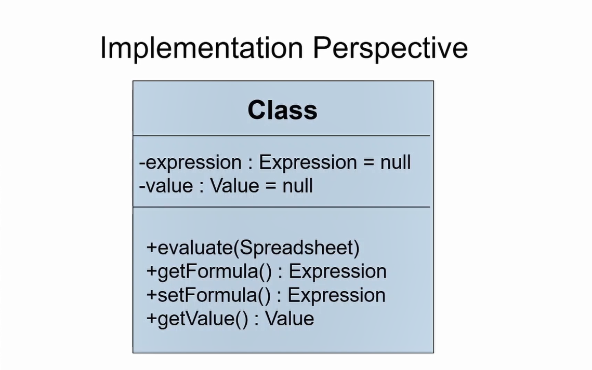

### RelationShips between classes in UML

클래스간의 관계를 보여주는 6가지의 주요 표기 유형이 있습니다.
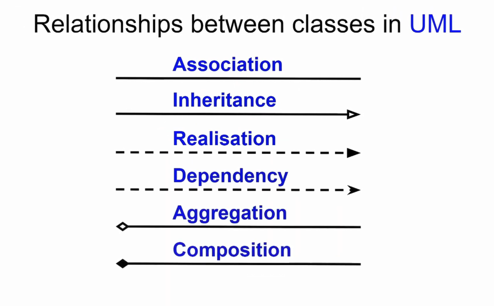

#### Association

UML (Unified Modeling Language)에서 **Association**은 두 클래스 또는 객체 사이의 관계를 나타내는 중요한 모델링 개념입니다. 이 연관 관계는 한 클래스의 객체들이 다른 클래스의 객체들과 어떻게 상호작용하는지를 설명하며, 데이터 모델이나 소프트웨어 시스템의 구조적인 측면을 표현할 때 사용됩니다.

**Association의 주요 특징**

1.  양방향성: Association은 대부분의 경우 양방향성을 가집니다. 이는 A 클래스의 객체가 B 클래스의 객체를 알고 있고, 반대로 B 클래스의 객체도 A 클래스의 객체를 알 수 있음을 의미합니다.
2.  카디널리티(다중성): Association은 각 연결 끝에서의 다중성을 명시할 수 있습니다. 다중성은 연관된 객체들 사이의 가능한 인스턴스 수를 나타냅니다. 예를 들어, "하나의 학생은 여러 코스를 수강할 수 있고, 하나의 코스는 여러 학생에 의해 수강될 수 있다"는 관계에서 학생과 코스 사이의 다중성은 "다대다"(many-to-many)가 됩니다.
3.  역할: 각 연결 끝에는 역할 이름이 붙을 수 있습니다. 이 역할 이름은 해당 클래스가 연관 관계에서 어떤 역할을 하는지 설명합니다. 예를 들어, 주문과 제품 사이의 관계에서 주문은 "주문자", 제품은 "주문된 항목"으로 레이블될 수 있습니다.
4.  내비게이션: 연관은 내비게이션이 가능할 수 있습니다, 즉, 한 클래스에서 다른 클래스로의 접근 경로를 표시할 수 있습니다. 내비게이션은 종종 화살표로 표현되어 어느 방향으로 데이터가 흐르는지를 나타냅니다.
5.  집합과 합성의 관계: Association은 더 특정한 형태인 집합(Aggregation)과 합성(Composition)으로 세분화될 수 있습니다. 집합은 "전체와 부분"의 관계를 약하게 나타내며, 합성은 더 강한 종속적 "전체와 부분"의 관계를 나타냅니다.

**Association의 사용 예**  
예를 들어, 학교 관리 시스템에서, "학생" 클래스와 "수업" 클래스 사이에는 Association 관계가 있을 수 있습니다. 이 경우, 각 학생 객체는 여러 수업을 들을 수 있으며, 각 수업은 여러 학생에게 제공될 수 있습니다. 이 관계를 설계함으로써, 시스템은 어떤 학생이 어떤 수업을 듣고 있는지 쉽게 파악하고 관리할 수 있습니다.

Association은 UML 다이어그램에서 시스템의 다양한 요소들 사이의 연결을 정확하게 표현하는 데 필수적인 도구이며, 시스템의 데이터 구조와 동작을 설계하는 데 매우 중요합니다.

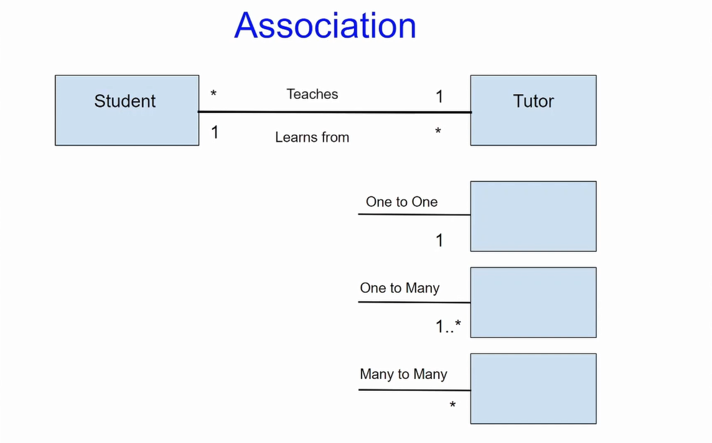

#### Generalization

UML (Unified Modeling Language)에서 **Generalization**은 객체 지향 프로그래밍의 상속 개념을 표현하는 방법입니다. 일반화는 한 클래스(하위 클래스 또는 자식 클래스)가 다른 클래스(상위 클래스 또는 부모 클래스)의 속성과 행동을 상속받는 관계를 나타냅니다. 이를 통해 코드 재사용성을 높이고, 시스템의 계층적 구조를 명확하게 만들어, 유지보수와 확장성을 개선합니다.

**Generalization의 주요 특징**

1.  계층적 관계: Generalization은 클래스 간의 계층적 관계를 설립합니다. 상위 클래스는 공통의 속성과 메소드를 정의하며, 하위 클래스는 이를 상속받아 추가적인 특성이나 행동을 구현할 수 있습니다.
2.  재사용성 및 확장성: 상위 클래스의 코드를 재사용하여 각 하위 클래스가 필요로 하는 특수한 기능만 추가함으로써, 개발 시간을 절약하고 시스템의 확장성을 향상시킬 수 있습니다.
3.  타입 계층: 하위 클래스는 상위 클래스의 타입을 유지합니다. 이는 다형성을 가능하게 하여, 상위 클래스 타입의 변수가 하위 클래스의 인스턴스를 참조할 수 있게 합니다. 이로 인해 더 일반적인 코드 작성이 가능해지며, 다양한 실행 시 시나리오에서 유연성을 제공합니다.
4.  추상화: 종종 상위 클래스는 추상 클래스로 구현됩니다. 추상 클래스는 인스턴스화될 수 없으며, 하나 이상의 추상 메소드를 포함할 수 있습니다. 이러한 메소드는 하위 클래스에서 구현되어야 합니다.
5.  UML 표기법: UML 다이어그램에서, Generalization 관계는 하위 클래스에서 상위 클래스로 향하는 빈 화살표(삼각형 화살표)로 표현됩니다. 이 화살표는 일반적으로 하위에서 상위로의 상속을 나타내며, "is a" 관계를 설명합니다.

**Generalization의 사용 예**

예를 들어, "차량"이라는 상위 클래스가 있고, "자동차", "트럭", "오토바이"라는 하위 클래스가 있다고 가정해봅시다. 여기서 "차량" 클래스는 모든 차량이 공통적으로 갖는 속성과 메소드(예: 엔진, 바퀴 수, 운전 메소드 등)를 정의할 수 있고, 각 하위 클래스는 이를 상속받아 자신만의 특성을 추가로 정의할 수 있습니다. "자동차" 클래스는 문의 수를 추가로 정의할 수 있고, "트럭" 클래스는 화물을 적재할 수 있는 용량을 추가로 정의할 수 있습니다.

Generalization은 시스템의 설계를 단순화하고 코드의 재사용을 극대화하는 중요한 방법으로, 객체 지향 설계의 핵심 요소 중 하나입니다. 이를 통해 개발자는 보다 깔끔하고 관리하기 쉬운 코드를 작성할 수 있습니다.

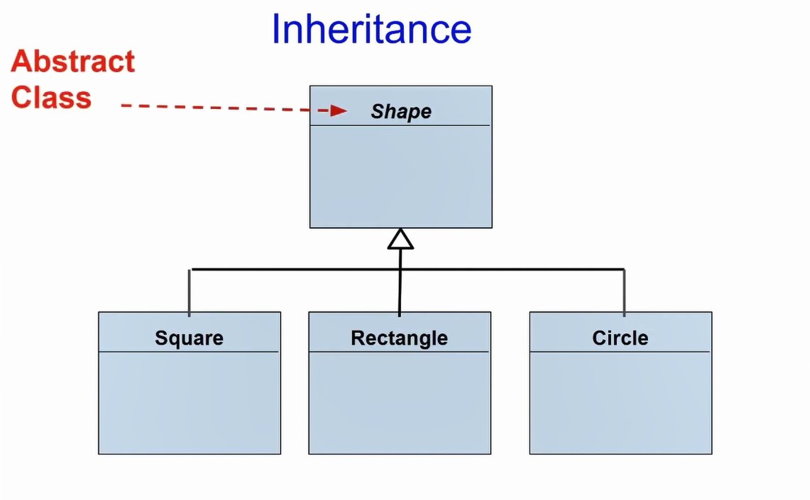

#### Realization

UML (Unified Modeling Language)에서 **Realization**은 한 요소가 다른 요소의 사양이나 계약을 구현할 때 사용되는 관계를 나타냅니다. 가장 흔히 인터페이스와 그 인터페이스를 구현하는 클래스 사이의 관계로 표현됩니다. 이 관계는 클래스가 인터페이스의 모든 메소드를 구현해야 함을 의미합니다.

Realization의 주요 특징

1.  인터페이스의 구현: Realization은 클래스가 인터페이스의 사양을 구현한다는 것을 나타냅니다. 인터페이스는 메소드의 시그니처만을 제공하고, 실제 메소드의 본체는 클래스에서 정의됩니다.
2.  계약 준수: 클래스는 인터페이스에 정의된 모든 메소드를 구현해야 하며, 이는 클래스가 인터페이스가 요구하는 "계약"을 준수해야 함을 의미합니다.
3.  다형성 지원: 인터페이스를 사용하면 다양한 클래스가 동일한 인터페이스를 구현할 수 있으므로, 다형성을 통해 코드의 유연성과 재사용성을 높일 수 있습니다. 이는 다양한 객체가 같은 인터페이스를 공유할 수 있으므로, 코드 내에서 객체를 교체하기 쉬워집니다.
4.  UML 표기법: UML 다이어그램에서, Realization 관계는 점선으로 된 화살표와 함께 화살표 끝에 빈 삼각형을 사용하여 표현됩니다. 화살표는 구현 클래스에서 인터페이스로 향합니다.

**Realization의 사용 예**  
예를 들어, **Vehicle**라는 인터페이스가 start(), stop() 같은 메소드를 정의하고 있을 때, **Car**, **Motorcycle**, **Bus** 등 다양한 클래스가 이 **Vehicle** 인터페이스를 구현할 수 있습니다. 각 클래스는 start()와 stop() 메소드를 자신의 특성에 맞게 구현합니다. 이렇게 하면 **Vehicle** 인터페이스를 사용하는 코드는 어떤 특정 클래스의 객체가 사용되는지 몰라도 이 메소드들을 호출할 수 있습니다.

**Realization의 중요성**

-   유연성과 확장성: 인터페이스의 구현은 코드의 유연성을 높이고, 새로운 클래스가 시스템에 쉽게 추가될 수 있도록 합니다.
-   유지보수성: 인터페이스를 통해 시스템의 다양한 부분을 독립적으로 개발하고 수정할 수 있어 유지보수가 용이해집니다.
-   재사용성: 인터페이스를 구현하는 새로운 클래스를 만들 때 기존의 인터페이스를 재사용할 수 있으므로, 코드 중복을 줄이고 전체적인 프로젝트의 일관성을 유지할 수 있습니다.

이처럼 Realization은 객체 지향 설계의 중요한 부분으로, 클래스의 기능을 모듈화하고, 시스템의 다양한 구성 요소 간에 명확한 계약을 설정하여, 전체적인 시스템 설계의 품질을 향상시킵니다.

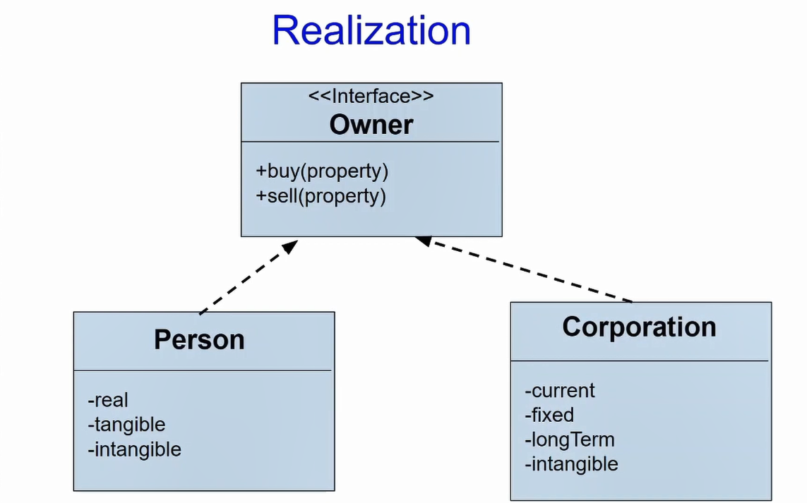

#### Dependency

UML (Unified Modeling Language)에서 **Dependency**는 두 모델 요소 간의 관계를 나타내며, 한 요소가 다른 요소에 의존하는 경우 사용됩니다. 의존성은 주로 한 요소의 변경이 다른 요소에 영향을 줄 수 있음을 의미합니다. 이 관계는 일반적으로 임시적이거나 약한 결합을 나타내며, 변경의 전파 가능성을 표현합니다.

**Dependency의 주요 특징**

1.  약한 결합: Dependency는 시스템 내의 다른 요소들 사이의 약한 결합을 나타냅니다. 의존하는 요소는 의존 대상 요소 없이는 그 기능을 완전히 수행할 수 없습니다.
2.  변경 전파: 한 요소가 변경될 때 의존하고 있는 다른 요소에도 영향을 미칠 수 있습니다. 예를 들어, 한 클래스가 다른 클래스의 메서드를 호출하면, 호출되는 클래스의 메서드에 변경이 생길 경우 호출하는 클래스도 영향을 받을 수 있습니다.
3.  방향성: Dependency는 방향성을 가집니다. 이는 한 요소가 다른 요소에 의존한다는 것을 나타내며, UML 다이어그램에서는 점선 화살표로 표현됩니다. 화살표는 의존하는 요소에서 의존 받는 요소로 향합니다.
4.  사용 시나리오: Dependency는 보통 다음과 같은 경우에 사용됩니다:

-   사용(Use): 한 클래스가 다른 클래스의 인스턴스를 사용하는 경우.
-   생성(Create): 한 클래스가 다른 클래스의 인스턴스를 생성하는 경우.
-   호출(Call): 한 클래스의 메서드가 다른 클래스의 메서드를 호출하는 경우.
-   파생(Derive): 한 요소의 값이 다른 요소의 값에 의해 파생되는 경우.

**Dependency의 UML 표기법**  
UML 다이어그램에서 Dependency는 점선 화살표(\`---->\`)로 표현되며, 화살표 끝은 개방형 화살표로 되어 있습니다. 이는 다이어그램을 보는 사람에게 한 요소가 다른 요소의 구현이나 행동에 직접적으로 의존한다는 것을 명확하게 보여줍니다.

**Dependency의 중요성**  
Dependency는 시스템 설계에서 중요한 요소 간의 관계를 명확히 하고, 시스템의 설계를 이해하며 리팩토링이나 확장시 결정을 내리는 데 중요한 역할을 합니다. 시스템의 유연성과 유지보수성을 높이기 위해 종종 의존성을 최소화하는 방향으로 설계를 고려합니다. 이런 관계를 명확하게 모델링하고 관리함으로써, 시스템 내의 요소들이 서로 어떻게 상호작용하는지, 그리고 어떤 요소가 시스템의 다른 부분에 어떤 영향을 미칠 수 있는지 이해할 수 있습니다.

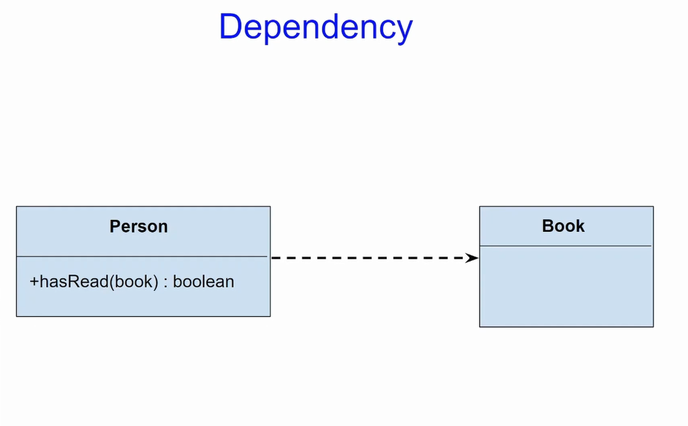

#### Aggregation
​
UML (Unified Modeling Language)에서 **Aggregation**은 특별한 형태의 연관 관계로, **전체-부분**(whole-part) 관계를 나타냅니다. 이 관계는 한 객체가 다른 객체를 포함하지만, 포함되는 객체가 독립적인 생명주기를 갖는다는 것을 의미합니다. 즉, **전체** 객체가 소멸해도 **부분** 객체는 그대로 존재할 수 있습니다.
​
Aggregation의 주요 특징
​
1.  전체와 부분의 관계: Aggregation은 객체 간에 전체와 부분의 관계를 나타내며, 이는 한 객체(전체)가 다른 하나 또는 여러 객체(부분)를 포함하는 것을 말합니다. 예를 들어, '도서관'과 '책' 사이에는 Aggregation 관계가 있을 수 있습니다. 도서관(전체)은 여러 책(부분)을 포함하지만, 책은 도서관이 없어도 존재할 수 있습니다.
2.  독립적인 생명주기: Aggregation에서는 부분 객체가 전체 객체에 속해 있지만, 자신의 생명주기를 독립적으로 갖습니다. 이는 부분 객체가 전체 객체와 함께 생성되거나 소멸할 필요가 없다는 것을 의미합니다.
3.  공유 가능성: Aggregation은 부분 객체가 여러 전체 객체에 공유될 수 있음을 나타낼 수 있습니다. 예를 들어, 한 프로그램 내의 여러 프로젝트가 동일한 데이터베이스 인스턴스를 사용할 수 있습니다.
4.  UML 표기법: UML 다이어그램에서 Aggregation은 점선 또는 실선과 함께 빈 다이아몬드로 표시되는 화살표로 나타냅니다. 화살표는 전체 객체에서 부분 객체로 향하며, 빈 다이아몬드는 전체 객체의 끝에 위치합니다.
​
**Aggregation vs. Composition**  
Aggregation과 자주 혼동되는 또 다른 연관 관계인 Composition도 전체-부분 관계를 나타내지만, Composition에서는 부분 객체가 전체 객체의 생명주기에 완전히 의존합니다. 즉, 전체 객체가 소멸하면 부분 객체도 함께 소멸합니다. 이와 대조적으로 Aggregation은 부분 객체가 전체 객체 없이도 독립적으로 존재할 수 있다는 점에서 차이가 있습니다.
​
**예시**  
교육 기관과 학과의 관계를 예로 들 수 있습니다. 하나의 교육 기관(전체)은 여러 학과(부분)를 포함할 수 있습니다. 각 학과는 교육 기관에 속해 있지만, 교육 기관이 없어져도 학과는 다른 형태로 존재할 수 있습니다.
​
Aggregation은 시스템 설계에서 객체 간의 관계를 명확하게 정의하고, 객체의 구조와 상호작용을 효율적으로 관리하기 위해 중요한 모델링 도구입니다. 이를 통해 시스템의 설계자와 개발자는 객체들 간의 관계를 더 잘 이해하고, 시스템의 구조를 효과적으로 계획할 수 있습니다.

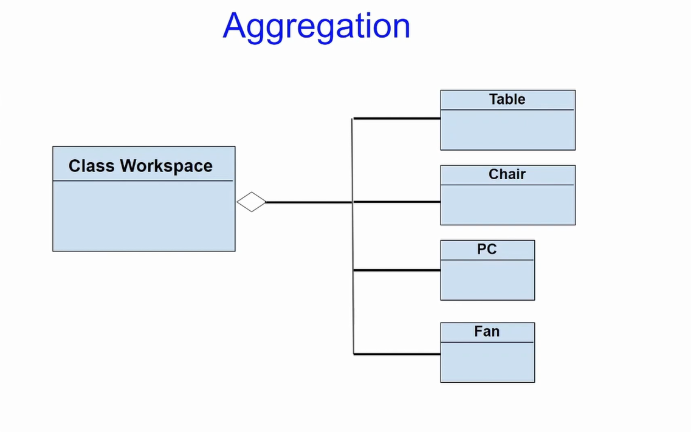

Composition
UML (Unified Modeling Language)에서 Composition은 객체 간의 강한 전체-부분 관계를 나타냅니다. 이 관계는 Aggregation보다 강한 형태로, 부분 객체가 전체 객체의 생명주기와 완전히 종속되어 있음을 의미합니다. 즉, 전체 객체가 소멸하면 그와 연결된 부분 객체들도 함께 소멸합니다.

Composition의 주요 특징

강한 전체-부분 관계: Composition은 전체 객체와 부분 객체 간에 강한 의존성을 나타냅니다. 부분 객체는 전체 객체에 속해 있으며, 전체 객체 없이는 존재할 수 없습니다.
독점적 소유: 전체 객체는 부분 객체를 독점적으로 소유합니다. 부분 객체는 다른 어떤 전체 객체와도 공유되지 않습니다.
생명주기의 종속성: 부분 객체의 생성과 소멸은 전체 객체의 생성과 소멸에 직접적으로 연결되어 있습니다. 이는 전체 객체가 관리하는 자원이나 구성 요소가 전체 객체와 동일한 생명주기를 갖는다는 것을 의미합니다.
UML 표기법: UML 다이어그램에서 Composition은 실선과 함께 채워진 검은 다이아몬드로 표시되는 화살표로 나타냅니다. 화살표는 전체 객체에서 부분 객체로 향하며, 채워진 다이아몬드는 전체 객체의 끝에 위치합니다.
Composition vs. Aggregation
Composition과 비교하여, Aggregation은 부분 객체가 전체 객체 없이도 독립적으로 존재할 수 있는 더 약한 형태의 전체-부분 관계를 나타냅니다. Aggregation에서는 부분 객체가 여러 전체 객체와 공유될 수도 있지만, Composition에서는 부분 객체가 전체 객체에 완전히 종속되며, 다른 어떤 객체와 공유되지 않습니다.

예시
예를 들어, "Orders"과 "Order_Details"의 관계를 생각해 볼 수 있습니다. 주문 객체가 생성될 때 주문 항목도 함께 생성되며, 주문 객체가 소멸하면 모든 주문 항목도 함께 소멸합니다. 이러한 관계는 주문 항목이 주문 없이는 의미가 없기 때문에 Composition으로 모델링하는 것이 적절합니다.

Composition의 중요성
Composition은 시스템 설계에서 전체 객체와 그에 속하는 부분 객체 간의 강력한 연결을 명확히 할 필요가 있을 때 사용됩니다. 이러한 모델링은 시스템의 구조적 무결성을 보장하고, 객체 관리와 자원 해제를 더욱 효과적으로 할 수 있게 도와줍니다. 시스템의 유지보수와 확장성에 중대한 영향을 미치며, 개발자가 객체 간의 관계를 더 명확하게 이해하고 정확히 구현할 수 있도록 합니다.

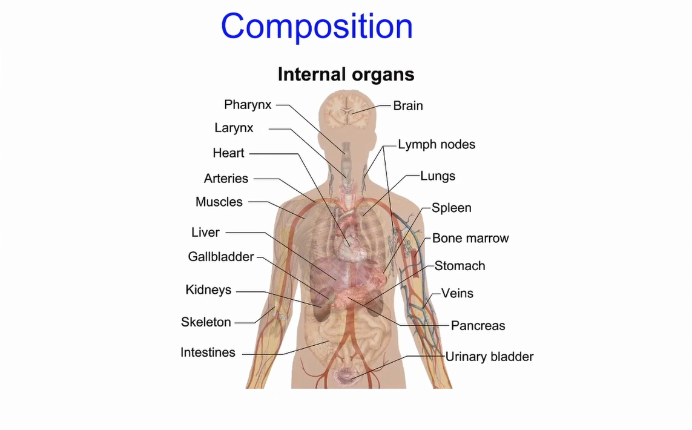
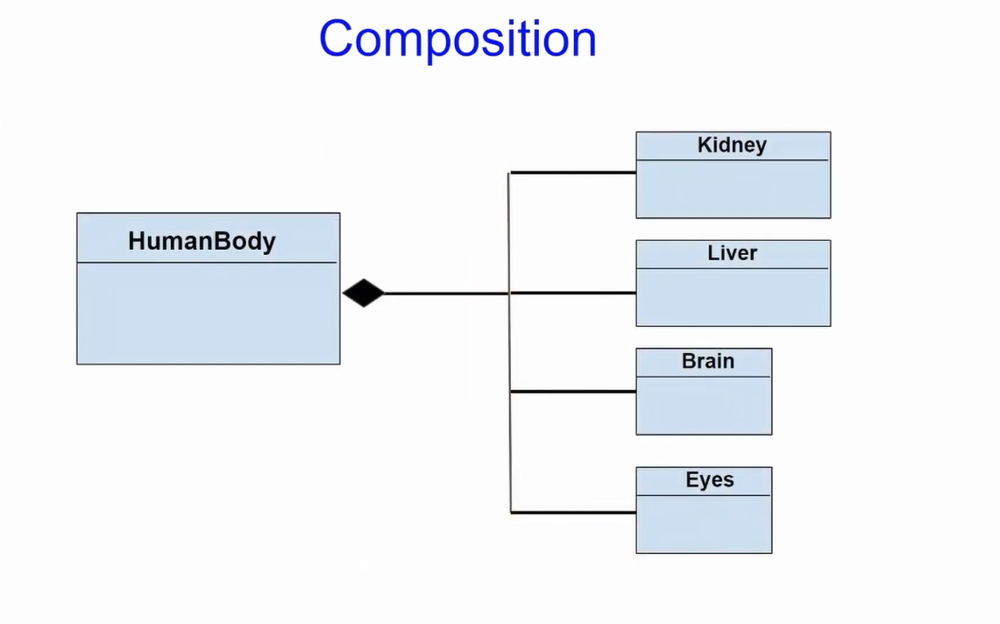