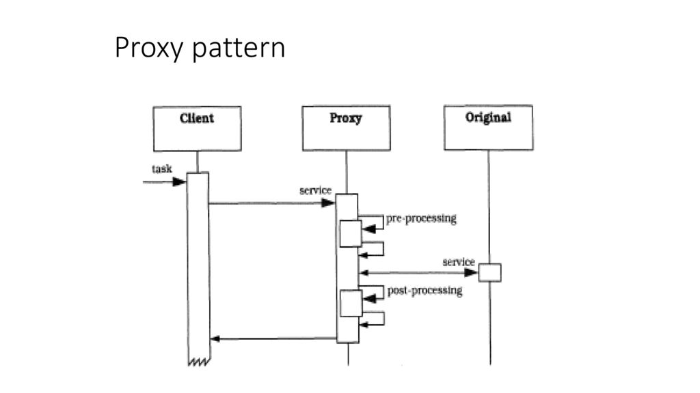

### Java Dynamic Proxy Classes
[Design Pattern of Proxy](https://refactoring.guru/ko/design-patterns/proxy)  
다이나믹 프록시 클래스는 런타임에, 지정된 인터페이스 목록을 구현하는 클래스입니다. 이러한 클래스의 인스턴스를 통해 인터페이스의 메서드를 호출하면 해당 호출이 인코딩되어 다른 객체로 전달됩니다.  
이 객체는 일관된 인터페이스를 통해 호출을 처리하게 됩니다.  
따라서 다이나믹 프록시 클래스는 컴파일 타임 도구를 사용하지 않고도 인터페이스 목록에 대한 타입 안전한 프록시 객체를 생성하는 데 사용할 수 있습니다.  
다이나믹 프록시 클래스의 인스턴스에서 메서드가 호출되면, 이 호출은 해당 인스턴스의 Invocation Handler에 있는 단일 메서드[invoke]로 전달되며,  
호출된 메서드를 식별하는 java.lang.reflect.Method 객체와 메서드 아규먼트를 포함하는 Object 타입 배열로 인코딩됩니다.  
>**java.lang.reflect.Method 객체**
>- java.lang.reflect.Method 클래스는 자바의 리플렉션 API에서 사용되며, 특정 클래스의 특정 메서드에 대한 메타데이터(예: 메서드 이름, 반환 타입, 파라미터 타입 등)를 제공하는 클래스입니다.
>- Method 객체는 java.lang.reflect.Method 클래스의 인스턴스로, 특정 클래스에 정의된 메서드를 나타냅니다.
>- 이 Method 객체를 통해 해당 메서드의 다양한 정보를 조회할 수 있으며, 실제로 메서드를 호출하는 데도 사용할 수 있습니다.

다이나믹 프록시 클래스는 인터페이스 API를 제공하는 객체에 대해 타입 안전한 리플렉티브 디스패치를 제공해야 하는 애플리케이션이나 라이브러리에 유용합니다. 예를 들어, 애플리케이션은 다이나믹 프록시 클래스를 사용하여 다양한 유형의 이벤트를 균일하게 처리하기 위해 여러 임의의 이벤트 리스너 인터페이스(java.util.EventListener를 확장하는 인터페이스)를 구현하는 객체를 생성할 수 있으며, 예를 들어 모든 이벤트를 파일에 로깅[공통 관심사]할 수 있습니다.




이 그림은 **프록시 패턴(Proxy Pattern)**을 설명하는 다이어그램입니다. 프록시 패턴은 클라이언트와 실제 서비스 객체 사이에 대리인 역할을 하는 객체를 두어, 서비스 객체에 접근하기 전에 추가적인 로직을 처리하거나 접근을 제어하는 패턴입니다. 그림을 단계별로 설명하겠습니다.

1. **Client (클라이언트)**:
   - 클라이언트는 특정 작업(그림에서는 "task")을 수행하기 위해 요청을 보냅니다. 이 요청은 직접 서비스 객체로 전달되지 않고, 대신 프록시 객체를 통해 처리됩니다.

2. **Proxy (프록시)**:
   - 프록시는 클라이언트와 실제 서비스 객체 사이에 위치하며, 클라이언트로부터 받은 요청을 처리합니다.
   - 프록시 객체는 요청을 받아들이고, 그것을 실제 서비스 객체에 전달하기 전에 사전 처리(Pre-processing)와 같은 추가적인 작업을 수행할 수 있습니다.
   - 또한, 서비스 객체로부터 받은 응답을 클라이언트에게 돌려주기 전에 사후 처리(Post-processing)를 수행할 수도 있습니다.

3. **Original (실제 서비스 객체)**:
   - 이것은 프록시 객체가 클라이언트 대신 접근하는 실제 서비스 객체입니다.
   - 프록시 객체는 클라이언트로부터 받은 요청을 처리한 후, 이 요청을 실제 서비스 객체로 전달합니다.
   - 서비스 객체는 요청을 처리한 후, 응답을 프록시 객체로 다시 돌려보냅니다.

4. **Pre-processing (사전 처리)**:
   - 클라이언트의 요청이 실제 서비스 객체에 전달되기 전에 프록시에서 수행되는 작업입니다. 예를 들어, 접근 제어, 로깅, 요청 변환 등의 작업이 여기에 포함될 수 있습니다.

5. **Post-processing (사후 처리)**:
   - 실제 서비스 객체에서 반환된 응답을 프록시에서 추가로 처리하는 단계입니다. 이 단계에서는 응답 데이터를 변환하거나, 로깅, 캐싱 등의 작업을 할 수 있습니다.

이 다이어그램은 프록시 패턴의 작동 방식을 시각적으로 잘 설명하고 있으며, 클라이언트가 실제 서비스 객체에 직접 접근하는 대신 프록시를 통해 간접적으로 접근함으로써 얻을 수 있는 이점들을 보여줍니다.


### Target Class  
"타겟 클래스(target class)"는 실제로 다이나믹 프록시가 대리하는 인터페이스의 구현체를 의미합니다. 다이나믹 프록시는 특정 인터페이스를 구현하는 클래스의 메서드 호출을 가로채서 처리할 수 있게 해줍니다. 다이나믹 프록시는 런타임에 생성되며, 주로 java.lang.reflect.Proxy와 java.lang.reflect.InvocationHandler를 사용하여 구현됩니다.


### 타겟 클래스와 다이나믹 프록시의 관계
[타겟클래스의 조건](./Criteria_For_The_ProxyTargetClass.md)  
1. **타겟 클래스**:
   - 타겟 클래스는 특정 인터페이스를 구현한 클래스입니다. 다이나믹 프록시가 이 타겟 클래스의 메서드를 호출할 때, 실제로는 다이나믹 프록시가 모든 메서드 호출을 가로채고, 이 호출을 처리하기 위해 프록시 핸들러를 호출합니다.
   - 예를 들어, `MyService`라는 인터페이스가 있고, `MyServiceImpl`이라는 클래스가 이를 구현한다고 가정합시다. 이때, `MyServiceImpl`이 바로 타겟 클래스입니다.

2. **InvocationHandler**: 
    지난번에 설명한 InvocationHandler 를 참조해주세요.   
   - 다이나믹 프록시의 핵심은 `InvocationHandler` 인터페이스를 구현하는 클래스입니다. 이 클래스는 모든 메서드 호출을 가로채고, 그 호출을 `invoke` 메서드로 전달합니다.
   - `invoke` 메서드는 세 개의 매개변수를 받습니다: 
     - `proxy`: 현재 다이나믹 프록시 객체.
     - `method`: 호출된 메서드 객체.
     - `args`: 메서드에 전달된 인자들.

3. **Proxy.newProxyInstance**:
   - 다이나믹 프록시 인스턴스는 `Proxy.newProxyInstance` 메서드를 통해 생성됩니다. 이 메서드는 인터페이스, 클래스 로더, 그리고 `InvocationHandler`를 인자로 받습니다.
   - 이 메서드가 반환하는 객체는 타겟 클래스의 인터페이스를 구현하는 다이나믹 프록시 객체입니다.


### Dynamic Proxy Class API
다이나믹 프록시 클래스(이하 프록시 클래스)는 런타임에 생성된 클래스가 구현하는 인터페이스 목록을 구현하는 클래스입니다.  
- 프록시 인터페이스: 프록시 클래스가 구현하는 인터페이스를 가리킵니다.  
- 프록시 인스턴스: 프록시 클래스의 인스턴스를 말합니다.

#### ex:
```java
@CallerSensitive
    public static Object newProxyInstance(ClassLoader loader,
                                          Class<?>[] interfaces,
                                          InvocationHandler h)
```


newProxyInstance 메서드는 지정된 인터페이스에 대한 프록시 인스턴스를 리턴하며, 이 프록시 인스턴스는 메서드 호출을 지정된 InvocationHandler로 전달합니다.  
이 메서드를 사용할 때 몇 가지 제약 조건을 준수해야 하며, 이를 위반하면 IllegalArgumentException이 발생할 수 있습니다. 주요 제약 사항은 다음과 같습니다:  

- interfaces 배열에 포함된 모든 Class 객체는 숨겨지지 않고[non-hidden:package-private] 봉인되지 않은[non-sealed] 인터페이스를 나타내야 하며, 클래스나 기본 타입이어서는 안 됩니다.
- interfaces 배열의 두 엘리먼트는 동일한 Class 객체를 참조할 수 없습니다.
    ```java
    Class<?>[] interfaces = {FirstInterface.class, SecondInterface.class, FirstInterface.class}; // 잘못된 예시
    // 수정된 예시
    Class<?>[] interfaces = {FirstInterface.class, SecondInterface.class}; // 올바른 예시
    ```   
- 모든 인터페이스 타입은 지정된 클래스 로더를 통해 이름으로 접근할 수 있어야 합니다. 즉, 클래스 로더 cl과 각 인터페이스 i에 대해 Class.forName(i.getName(), false, cl) == i가 참이어야 합니다
- 지정된 인터페이스의 모든 public 메서드 시그니처와 이들이 상속한 super 인터페이스에서 참조된 모든 타입은 지정된 클래스 로더를 통해 이름으로 접근할 수 있어야 합니다[참고](./클래스%20로딩과%20관련된%20제약조건.md)
- 모든 non-public 인터페이스는 동일한 패키지와 모듈에 있어야 하며, 해당 클래스 로더에 의해 정의된 모듈에서 모든 인터페이스 타입에 접근할 수 있어야 합니다. 그렇지 않으면 프록시 클래스가 모든 인터페이스를 구현할 수 없습니다.
- 동일한 시그니처(parameter 타입과, 개수)를 가진 인터페이스 메서드의 집합에 대해:
    - 메서드의 리턴 타입이 기본 타입이나 void인 경우, 모든 메서드가 동일한 리턴 타입을 가져야 합니다
    - 그렇지 않으면, 하나의 메서드 리턴 타입이 나머지 메서드의 리턴 타입에 할당 가능해야 합니다.
    - 생성된 프록시 클래스는 가상 머신이 클래스에 부과하는 제한을 초과해서는 안 됩니다. 예를 들어, VM이 클래스가 구현할 수 있는 인터페이스 수를 65535개로 제한하는 경우, 인터페이스 배열의 크기는 65535를 초과할 수 없습니다.

또한, 지정된 프록시 인터페이스의 순서가 중요합니다. 동일한 인터페이스 조합에 대해 순서가 다르면 두 개의 별개의 프록시 클래스가 생성됩니다.
**예시:**  
```java
// 첫 번째 인터페이스
interface FirstInterface {
    void firstMethod();
}

// 두 번째 인터페이스
interface SecondInterface {
    void secondMethod();
}

// InvocationHandler 구현
class MyInvocationHandler implements InvocationHandler {
    @Override
    public Object invoke(Object proxy, Method method, Object[] args) throws Throwable {
    	System.out.println("MyInvocationHandler:: invoke : class: " + proxy.getClass());
    	
    	if (method.getDeclaringClass().equals(FirstInterface.class)) {
            System.out.println("Invoked method from FirstInterface: " + method.getName());
        } else if (method.getDeclaringClass().equals(SecondInterface.class)) {
            System.out.println("Invoked method from SecondInterface: " + method.getName());
        } else {
            System.out.println("Invoked method from unknown interface: " + method.getName());
        }
        return null;
    }
}

public class ProxyExample {
    public static void main(String[] args) {
        // 클래스 로더
        ClassLoader classLoader = ProxyExample.class.getClassLoader();

        // 프록시 생성 - 인터페이스 순서: FirstInterface, SecondInterface
        Object proxy1 = Proxy.newProxyInstance(
                classLoader,
                new Class<?>[]{FirstInterface.class, SecondInterface.class},
                new MyInvocationHandler()
        );

        // 프록시 생성 - 인터페이스 순서: SecondInterface, FirstInterface
        Object proxy2 = Proxy.newProxyInstance(
                classLoader,
                new Class<?>[]{SecondInterface.class, FirstInterface.class},
                new MyInvocationHandler()
        );

        // 동일한 인터페이스 조합이지만 순서가 다르면 서로 다른 프록시 클래스가 생성됨
        System.out.println("proxy1 class: " + proxy1.getClass());
        System.out.println("proxy2 class: " + proxy2.getClass());
        
        FirstInterface firstProxy1 = (FirstInterface) proxy1;
        firstProxy1.firstMethod();
                
        SecondInterface secondProxy1 = (SecondInterface) proxy1;
        secondProxy1.secondMethod();
        
        FirstInterface firstProxy2 = (FirstInterface) proxy2;
        firstProxy2.firstMethod();
                
        SecondInterface secondProxy2 = (SecondInterface) proxy1;
        secondProxy2.secondMethod();
        
        // 두 프록시 클래스는 다름
        System.out.println("Are proxy1 and proxy2 classes the same? " + (proxy1.getClass() == proxy2.getClass()));
    }
}
```
실행결과 결과:    
```shell
proxy1 class: class com.sun.proxy.$Proxy0
proxy2 class: class com.sun.proxy.$Proxy1
Are proxy1 and proxy2 classes the same? false
```  

프록시 클래스는 프록시 인터페이스라고 하는 지정된 인터페이스 목록을 구현하는 **런타임**에 생성된 클래스입니다.  
프록시 인스턴스는 프록시 클래스의 인스턴스입니다. 각 프록시 인스턴스에는 연관된 invocation handler 객체가 있으며, 이 객체는 인터페이스 InvocationHandler를 구현합니다. 프록시 인터페이스 중 하나를 통한 프록시 인스턴스의 메서드 호출은 인스턴스의 invocation handler의 invoke 메서드로 전송되어 프록시 인스턴스, 호출된 메서드를 식별하는 java.lang.reflect.Method 객체, 아규먼트를 포함하는 Object 타입의 배열을 전달합니다.  
invocation handler는 인코딩된 메서드 호출을 적절하게 처리하고 리턴하는 결과는 프록시 인스턴스의 메서드 호출 결과로 리턴됩니다.  

### Proxy Instance Properties  
프록시 인스턴스는 다음과 같은 속성을 가집니다:  

- 프록시 인스턴스 proxy와 그 프록시 클래스가 구현한 인터페이스 중 하나인 Foo가 주어졌을 때, 다음 표현식은 true를 반환합니다:  
    proxy instanceof Foo  
- 또한 다음 캐스트 연산이 성공하며(ClassCastException을 발생시키지 않고):  
    (Foo) proxy  
- 각 프록시 인스턴스에는 생성자에 전달된 Invocation Handler가 연관되어 있습니다. 정적 메서드 Proxy.getInvocationHandler는 전달된 프록시 인스턴스에 연관된 Invocation Handler 를 반환합니다.
- 프록시 인스턴스의 인터페이스 메서드를 호출하면, 이 호출은 해당 메서드에 대한 문서에 설명된 대로 InvocationHandler의 invoke 메서드로 인코딩되고 전달됩니다.
- 프록시 인터페이스는 디폴트 메서드를 정의하거나 슈퍼 인터페이스에서 직접 또는 간접적으로 디폴트 메서드를 상속받을 수 있습니다. Invocation Handler는 InvocationHandler::invokeDefault를 호출하여 프록시 인터페이스의 디폴트 메서드를 호출할 수 있습니다.[예저코드1^]
- 프록시 인스턴스의 java.lang.Object에 선언된 hashCode, equals, 또는 toString 메서드를 호출하면, 이 호출도 인터페이스 메서드 호출이 인코딩되고 전달되는 방식과 동일하게 InvocationHandler의 invoke 메서드로 인코딩되고 전달됩니다. invoke에 전달된 Method 객체의 선언 클래스는 java.lang.Object입니다. 
- 프록시 클래스에서 상속된 java.lang.Object의 다른 공용 메서드는 오버라이드되지 않으므로, 이러한 메서드의 호출은 java.lang.Object 인스턴스에서 호출될 때와 동일하게 동작합니다.


### Methods Duplicated in Multiple Proxy Interfaces    


[예제코드1^]:
```java
// 인터페이스 정의
interface MyInterface {
    // 디폴트 메서드 정의
    default void defaultMethod() {
        System.out.println("MyInterface: defaultMethod 실행됨");
    }

    void regularMethod();
}

// 실제 구현 클래스
class RealClass implements MyInterface {
    @Override
    public void regularMethod() {
        System.out.println("RealClass: regularMethod 실행됨");
    }
}

// 프록시 핸들러
class MyInvocationHandler implements InvocationHandler {
    private final Object realObject;

    public MyInvocationHandler(Object realObject) {
        this.realObject = realObject;
    }

    @Override
    public Object invoke(Object proxy, Method method, Object[] args) throws Throwable {
        if (method.isDefault()) {
            // 디폴트 메서드를 호출
            return InvocationHandler.invokeDefault(proxy, method, args);
        }
        System.out.println("프록시: 메서드 호출 전");
        Object result = method.invoke(realObject, args);
        System.out.println("프록시: 메서드 호출 후");
        return result;
    }
}

public class ProxyExample {
    public static void main(String[] args) {
        // 실제 객체 생성
        MyInterface realObject = new RealClass();

        // 프록시 객체 생성
        MyInterface proxyInstance = (MyInterface) Proxy.newProxyInstance(
            realObject.getClass().getClassLoader(),
            new Class[]{MyInterface.class},
            new MyInvocationHandler(realObject)
        );

        // 프록시를 통해 메서드 호출
        proxyInstance.regularMethod();
        proxyInstance.defaultMethod(); // 디폴트 메서드 호출
    }
}
``` 