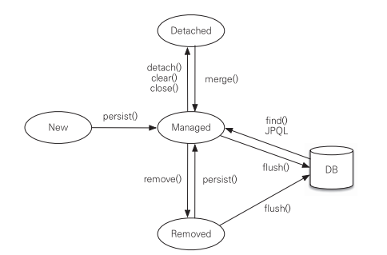

# 영속성 관리

## 엔티티 매니저(EntityManagerFactory) 팩토리와 엔티티 매니저(EntityManager)
엔티티 매니저는 엔티티를 저장, 수정, 삭제, 조회하는 등 엔티티와 관련된 모든 작업을 처리합니다. 이름 그대로, 엔티티를 관리하는 관리자 역할을 합니다. 개발자 입장에서는 엔티티 매니저를 엔티티를 저장하는 가상의 데이터베이스로 생각하시면 됩니다.  

---
애플리케이션이 하나의 데이터베이스만 사용하는 경우, 일반적으로 **EntityManagerFactory**는 한 번만 생성됩니다.

```java
EntityManagerFactory emf = Persistence.createEntityManagerFactory("jpabook");
```

위 코드는 `META-INF/persistence.xml` 파일에 있는 설정 정보를 바탕으로 **EntityManagerFactory**를 생성합니다. 이후에는 필요할 때마다 이 **EntityManagerFactory**에서 **EntityManager**를 생성하여 사용하면 됩니다.

```java
EntityManager em = emf.createEntityManager(); // 팩토리에서 엔티티 매니저 생성 (비용이 거의 들지 않음)
```

**EntityManagerFactory**는 이름 그대로 **EntityManager**를 생성하는 "공장" 역할을 합니다. 하지만 이 공장을 생성하는 데는 큰 비용이 듭니다. 따라서 **EntityManagerFactory**는 애플리케이션 전체에서 하나만 생성하고, 모든 곳에서 공유하는 방식으로 설계됩니다. 반면, **EntityManager**를 생성하는 것은 비용이 거의 들지 않으므로 필요할 때마다 쉽게 생성할 수 있습니다.

중요한 점은 **EntityManagerFactory**는 **여러 스레드가 동시에 접근해도 안전**하다는 것입니다. 따라서 여러 스레드에서 공유해서 사용할 수 있습니다. 반면, **EntityManager**는 **스레드 간에 공유하면 동시성 문제**가 발생할 수 있습니다. 즉, **EntityManager**는 한 번 생성된 이후에는 하나의 스레드에서만 사용해야 하며, 여러 스레드에서 동시에 접근하지 않도록 주의해야 합니다. 

이 요약으로 보면, **EntityManagerFactory**는 비용이 크지만 한 번만 생성하여 애플리케이션 전반에 걸쳐 재사용되고, **EntityManager**는 가볍고 필요한 만큼 생성하여 각각의 스레드가 독립적으로 사용해야 하는 객체입니다.  


위 그림에서 볼 수 있듯이, 하나의 **EntityManagerFactory**에서 여러 개의 **EntityManager**가 생성되었습니다. 이 중 **EntityManager1**은 아직 데이터베이스 커넥션을 사용하지 않고 있습니다. 이는 **EntityManager**가 실제로 데이터베이스 연결을 필요로 하는 시점까지 커넥션을 얻지 않기 때문입니다. 즉, **엔티티 매니저는 실제 데이터베이스와 상호작용하기 전까지는 커넥션을 요청하지 않습니다**. 반면, **EntityManager2**는 현재 커넥션을 사용 중이며, 이는 보통 트랜잭션을 시작할 때 커넥션을 획득하기 때문입니다.

JPA 구현체(예: **Hibernate**)는 **EntityManagerFactory**를 생성할 때 **커넥션 풀(connection pool)**도 함께 생성합니다. 이 커넥션 풀은 `persistence.xml` 파일에 정의된 데이터베이스 접속 정보를 기반으로 설정됩니다. 커넥션 풀은 데이터베이스와의 연결을 효율적으로 관리하여, 애플리케이션이 필요할 때 빠르게 연결을 사용할 수 있도록 도와줍니다.

이 방식은 주로 **J2SE(Java 2 Standard Edition)** 환경에서 사용됩니다. 그러나 **J2EE(Java 2 Enterprise Edition)** 환경이나 스프링 프레임워크와 같은 엔터프라이즈 환경에서는 상황이 조금 다릅니다. 이러한 환경에서는 해당 애플리케이션 서버나 컨테이너가 제공하는 **데이터 소스(DataSource)**를 사용하여 커넥션을 관리합니다. 즉, 데이터베이스 연결에 대한 세부 사항을 애플리케이션이 직접 처리하지 않고, 컨테이너가 제공하는 데이터 소스를 통해 안전하고 효율적으로 커넥션을 사용할 수 있습니다.

정리하자면:

1. **EntityManager**는 실제로 필요한 시점까지 데이터베이스 커넥션을 요청하지 않습니다.
2. 일반적으로 트랜잭션이 시작될 때 커넥션을 획득합니다.
3. JPA 구현체(예: Hibernate)는 **EntityManagerFactory**를 생성할 때 **커넥션 풀**도 함께 생성하며, 이를 통해 성능을 최적화합니다.
4. **J2SE** 환경에서는 `persistence.xml`의 설정을 기반으로 커넥션이 관리되며, **J2EE** 환경에서는 컨테이너가 제공하는 **DataSource**를 사용하여 커넥션을 관리합니다.

### 영속성 컨텍스트(persistence context)
>"영속성 컨텍스트"라는 단어를 다른 자료와 함께 볼 때 혼란이 오지 않도록, 앞으로는 "persistence context"라고 부르겠습니다.

JPA에서 가장 중요한 개념 중 하나는 **Persistence Context**입니다. 이 개념은 "엔티티를 영구적으로 저장하고 관리하는 환경"을 의미합니다. **Persistence Context**는 엔티티가 데이터베이스와 연결되기 전까지 임시로 머물러 있는 메모리 공간이라고 생각할 수 있습니다.

예를 들어, **EntityManager**로 엔티티를 저장하거나 조회하면, **EntityManager**는 해당 엔티티를 **Persistence Context**에 보관하고 그 상태를 관리하게 됩니다.

```java
em.persist(member);
```

이 코드를 단순히 "회원 엔티티를 저장한다"고 표현할 수 있지만, 좀 더 정확하게 말하자면, `persist()` 메서드는 **EntityManager**를 사용하여 **회원 엔티티를 Persistence Context에 저장**하는 역할을 합니다. 이 과정에서 데이터베이스에 바로 저장되는 것이 아니라, 우선 **Persistence Context**에 엔티티가 등록되고 관리됩니다. 실제 데이터베이스에 저장되는 시점은 트랜잭션이 커밋될 때 발생합니다.

### `em.persist(member)` 메서드의 동작 과정:
1. **엔티티 등록**: `em.persist(member)`가 호출되면, `member` 엔티티는 **Persistence Context**에 등록됩니다. 이제 이 엔티티는 **Persistence** 상태가 되어, **JPA**가 해당 엔티티를 관리하게 됩니다.
2. **변경 사항 추적**: **Persistence Context**는 엔티티의 상태 변화를 추적합니다. 만약 `member` 엔티티의 필드 값이 변경되면, **Persistence Context**는 그 변경 사항을 인식하고, 나중에 트랜잭션이 커밋될 때 해당 변경 사항을 데이터베이스에 반영합니다.
3. **데이터베이스 반영 시점**: `persist()`가 호출되었다고 해서 곧바로 데이터베이스에 저장되는 것은 아닙니다. 실제로 데이터베이스에 반영되는 시점은 **트랜잭션이 커밋(commit)**될 때입니다. 이때 **Persistence Context**에 있는 변경 사항이 모두 데이터베이스에 반영됩니다.

### Persistence Context의 특성:
- **1차 캐시 역할**: **Persistence Context**는 **1차 캐시**로 동작합니다. 즉, 동일한 트랜잭션 내에서 같은 엔티티를 여러 번 조회하더라도 데이터베이스에 다시 접근하지 않고, **Persistence Context**에 저장된 엔티티를 사용합니다.
- **변경 감지(Dirty Checking)**: **Persistence Context**는 엔티티의 상태를 추적하면서, 변경된 사항이 있을 경우 트랜잭션이 커밋될 때 자동으로 그 변경 사항을 데이터베이스에 반영합니다.
- **지연 쓰기(Write Behind)**: **Persistence Context**는 트랜잭션이 끝날 때까지 데이터를 데이터베이스에 바로 쓰지 않고 지연시킵니다. 이로 인해 여러 변경 작업이 일어나더라도 성능이 최적화될 수 있습니다.

### Persistence Context는 논리적인 개념
**Persistence Context**는 논리적인 개념으로, 실제 눈에 보이는 물리적인 객체는 아닙니다. **EntityManager**가 생성될 때 **Persistence Context**가 함께 만들어지며, **EntityManager**를 통해 **Persistence Context**에 접근하고 관리할 수 있습니다. 엔티티 매니저는 **Persistence Context**를 조작하는 역할을 하며, 이로 인해 엔티티의 상태 관리, 변경 사항 추적 등이 가능합니다.

이러한 방식으로 **JPA**는 데이터베이스와의 직접적인 상호작용을 추상화하고, 개발자가 엔티티의 상태를 관리하기 쉽게 만들어 줍니다. `em.persist()`는 **Persistence Context**에 엔티티를 등록하고, 이 엔티티의 생명 주기를 **JPA**가 관리하도록 해주는 중요한 메서드입니다.  
---


## 엔티티의 생명주기
---
엔티티에는 크게 4가지 상태가 있습니다. 이 상태들은 **Persistence Context**와의 관계에 따라 달라집니다. 엔티티가 어떤 상태에 있느냐에 따라 JPA가 해당 엔티티를 어떻게 처리할지 결정됩니다. 각 상태를 자세히 설명하겠습니다.



### 1. 비영속 (New/Transient)
비영속 상태는 **Persistence Context**와 전혀 관계가 없는 상태입니다. 엔티티 객체가 단순히 메모리 내에서만 존재할 뿐, **Persistence Context**나 데이터베이스와는 아무런 연결이 없습니다. 즉, 엔티티를 생성했지만 아직 **EntityManager**를 통해 **Persistence Context**에 저장하지 않은 상태입니다. 이 상태의 엔티티는 데이터베이스에 저장되지 않으며, JPA가 전혀 관리하지 않습니다.  
  
```java
// 객체를 생성한 상태 (비영속)
Member member = new Member();
member.setId("member1");
member.setUsername("회원1");
```

위 코드에서 `Member` 객체는 단순히 메모리 상에 존재하는 엔티티일 뿐, **Persistence Context**에 포함되지 않았습니다. 따라서 JPA는 이 객체를 전혀 관리하지 않습니다.

### 2. 영속 (Managed)
**Persistence Context**에 엔티티가 저장된 상태를 **영속** 상태라고 합니다. 이 상태에서는 엔티티가 **Persistence Context**에 의해 관리되며, JPA가 해당 엔티티의 상태를 추적합니다. 이 상태의 엔티티는 변경 사항이 발생하면 JPA가 자동으로 이를 감지하고, 트랜잭션이 커밋될 때 데이터베이스에 해당 변경 사항을 반영합니다.  
  
```java
// 객체를 저장한 상태 (영속)
em.persist(member);
```

`em.persist(member)`는 **EntityManager**를 통해 엔티티를 **Persistence Context**에 저장하는 메서드입니다. 여기서 주의할 점은 `persist()` 메서드가 호출된다고 해서 즉시 데이터베이스에 저장되는 것이 아니라, **Persistence Context**에 엔티티가 등록되고, 트랜잭션이 커밋될 때 실제로 데이터베이스에 반영됩니다.

#### `em.persist()` 메서드 설명:
- **등록**: `persist()` 메서드를 호출하면 엔티티가 **Persistence Context**에 등록됩니다. 이제 JPA가 해당 엔티티를 관리하며, 이 상태를 **영속 상태**라고 합니다.
- **변경 사항 관리**: 영속 상태의 엔티티는 **Persistence Context**에 의해 관리되므로, 필드 값을 변경하면 JPA가 그 변화를 자동으로 감지합니다. 트랜잭션이 종료될 때, 변경된 값이 데이터베이스에 반영됩니다.
- **커밋 시점에 반영**: `persist()`가 호출된 이후 실제로 데이터베이스에 저장되는 시점은 **트랜잭션 커밋** 시점입니다. 이때 **Persistence Context**에 있는 엔티티의 변경 사항이 모두 데이터베이스에 반영됩니다.

### 3. 준영속 (Detached)
**Persistence Context**가 더 이상 해당 엔티티를 관리하지 않는 상태를 **준영속(Detached)** 상태라고 합니다. 영속 상태였던 엔티티가 **Persistence Context**에서 분리되거나, **Persistence Context**가 초기화되면서 엔티티가 더 이상 관리되지 않게 될 때 발생합니다. 이 상태의 엔티티는 **Persistence Context**의 변경 감지나 1차 캐시 등의 기능을 사용할 수 없게 됩니다.

```java
// 엔티티를 영속성 컨텍스트에서 분리 (준영속 상태)
em.detach(member);
```

#### `em.detach()` 메서드 설명:
- **분리**: `detach()` 메서드는 **Persistence Context**에서 특정 엔티티를 분리하는 메서드입니다. 이 메서드가 호출되면 `member` 엔티티는 **Persistence Context**에서 관리되지 않으며, 더 이상 JPA가 해당 엔티티의 변경 사항을 추적하지 않습니다.
- **준영속 상태로 변환**: 분리된 엔티티는 **준영속 상태**가 되어 **Persistence Context**와는 아무런 관계가 없게 됩니다. 이제 엔티티는 변경되더라도 JPA가 이를 감지하거나 데이터베이스에 반영하지 않습니다.

다음과 같은 방법으로도 엔티티가 **준영속 상태**가 될 수 있습니다:
- `em.clear()`: **Persistence Context**를 초기화하여 관리 중인 모든 엔티티를 준영속 상태로 만듭니다.
- `em.close()`: **EntityManager**를 닫으면, **Persistence Context**도 함께 종료되어 모든 엔티티가 준영속 상태가 됩니다.

### 4. 삭제 (Removed)
**Persistence Context**와 데이터베이스에서 엔티티가 삭제된 상태입니다. 삭제된 엔티티는 더 이상 **Persistence Context**에서 관리되지 않으며, 트랜잭션이 커밋되면 데이터베이스에서도 삭제됩니다.

```java
// 엔티티를 삭제한 상태 (삭제)
em.remove(member);
```

#### `em.remove()` 메서드 설명:
- **삭제 요청**: `remove()` 메서드는 **Persistence Context**에 있는 엔티티를 삭제하는 메서드입니다. 이 메서드가 호출되면 해당 엔티티는 **Persistence Context**에서 관리되지 않으며, 트랜잭션이 커밋될 때 데이터베이스에서 삭제됩니다.
- **영속성 관리 해제**: `remove()` 호출 이후, 삭제된 엔티티는 더 이상 **Persistence Context**에서 관리되지 않으며, 이후 트랜잭션이 끝날 때 데이터베이스에서도 제거됩니다.

### 엔티티 상태 요약
- **비영속 (New/Transient)**: 엔티티가 **Persistence Context**와 전혀 관련이 없는 상태. 단순히 메모리 내에서만 존재하는 객체.
- **영속 (Managed)**: 엔티티가 **Persistence Context**에 저장된 상태. JPA가 해당 엔티티의 상태를 추적하고 관리함.
- **준영속 (Detached)**: 엔티티가 한때 **Persistence Context**에 저장되었으나, 현재는 더 이상 관리되지 않는 상태.
- **삭제 (Removed)**: 엔티티가 **Persistence Context**와 데이터베이스에서 삭제된 상태.

### 3.4.1 엔티티 조회

**Persistence Context**는 내부에 **1차 캐시**를 가지고 있습니다. 이 1차 캐시에는 **Persistence** 상태의 엔티티들이 저장됩니다. 쉽게 설명하자면, **Persistence Context**는 내부적으로 하나의 `Map`을 가지고 있고, 그 `Map`의 키는 **@Id**로 매핑된 엔티티의 식별자 값이며, 값은 엔티티 인스턴스입니다. 

#### 비유:
- **1차 캐시**는 엔티티 인스턴스를 메모리 상에서 캐싱하는 역할을 합니다.
- 식별자 값은 **데이터베이스의 기본 키**와 매핑되므로, **Persistence Context**는 기본적으로 데이터베이스의 기본 키를 기준으로 데이터를 저장하고 조회합니다.

#### 예제:

```java
// 엔티티를 생성한 상태 (비영속)
Member member = new Member();
member.setId("member1");
member.setUsername("회원1");

// 엔티티를 Persistence 상태로 만듦
em.persist(member);
```

위 코드를 실행하면, `member` 엔티티는 **Persistence Context**의 1차 캐시에 저장됩니다. 이 시점에서 엔티티는 **Persistence** 상태로 변경되었지만, 아직 데이터베이스에는 저장되지 않았습니다.


(이미지를 통해 **Persistence Context** 내부의 1차 캐시에 엔티티가 저장되는 과정을 설명)
(출처 :)

#### 1차 캐시에서의 조회:

이제 `em.find()` 메서드를 사용하여 엔티티를 조회할 수 있습니다.

```java
Member member = em.find(Member.class, "member1");
```

`em.find()` 메서드는 먼저 **1차 캐시**에서 해당 식별자 값으로 엔티티를 조회하려 시도합니다. 만약 1차 캐시에 엔티티가 있으면 데이터베이스를 조회하지 않고, 1차 캐시에서 엔티티를 반환합니다. 

**1차 캐시에서의 동작 순서**:
1. `em.find()` 호출 시 먼저 1차 캐시에서 식별자 값으로 엔티티를 조회합니다.
2. 1차 캐시에 엔티티가 있으면, 데이터베이스를 조회하지 않고 1차 캐시의 엔티티를 반환합니다.

```java
// 1차 캐시에 저장된 엔티티를 조회
Member findMember = em.find(Member.class, "member1");
```

이 코드는 1차 캐시에 있는 `member1` 엔티티를 반환하며, 데이터베이스에 추가적인 조회 요청을 보내지 않습니다.


**Persistence Context**의 1차 캐시에서 엔티티를 조회하는 과정  
(이미지를 통해 캐시에 있는 엔티티를 조회하는 과정을 설명)

#### 데이터베이스에서의 조회:

만약 **1차 캐시**에 엔티티가 없다면, **EntityManager**는 데이터베이스에서 해당 엔티티를 조회하여 새롭게 생성합니다. 그 후, 해당 엔티티를 1차 캐시에 저장하고 **Persistence** 상태로 관리합니다.

```java
Member findMember2 = em.find(Member.class, "member2");
```


[출처:](https://colevelup.tistory.com/22)
(이미지를 통해 데이터베이스에서 조회 후 캐시에 저장되는 과정을 설명)

위 코드를 실행하면, `member2` 엔티티가 1차 캐시에 없으므로 데이터베이스에서 조회하여 1차 캐시에 저장되고, 반환됩니다. 이제 `member1`과 `member2`는 모두 1차 캐시에 존재합니다.

#### 엔티티의 동일성 보장:

**Persistence Context**는 **엔티티의 동일성을 보장**합니다. 즉, 같은 식별자 값을 가진 엔티티는 항상 동일한 인스턴스를 반환합니다.

```java
Member a = em.find(Member.class, "member1");
Member b = em.find(Member.class, "member1");

// a == b는 참입니다.
```

여기서 `a == b`는 **참**입니다. 왜냐하면 `em.find()`를 통해 조회된 엔티티가 이미 1차 캐시에 존재하므로, 같은 식별자 값을 가진 동일한 인스턴스를 반환하기 때문입니다.

### 3.4.2 엔티티 등록

**EntityManager**를 사용하여 엔티티를 **Persistence Context**에 등록하는 과정을 살펴보겠습니다. **Persistence** 상태의 엔티티는 1차 캐시에 저장되고, 그 후 **쓰기 지연(transactional write-behind)** 메커니즘을 통해 데이터베이스에 반영됩니다.

```java
EntityManager em = emf.createEntityManager();
EntityTransaction transaction = em.getTransaction();

transaction.begin(); // 트랜잭션 시작

em.persist(memberA);
em.persist(memberB);

// 이 시점까지 INSERT SQL은 실행되지 않습니다.

transaction.commit(); // 트랜잭션 커밋 (여기서 INSERT SQL이 실행됩니다)
```

#### `em.persist()` 메서드 설명:
- **등록**: `em.persist()`는 엔티티를 **Persistence Context**에 저장합니다. 이때 데이터베이스에 즉시 반영되지 않고, 트랜잭션 커밋 시점에 데이터베이스에 반영됩니다.
- **쓰기 지연**: `persist()`가 호출되면 **Persistence Context**는 등록된 엔티티의 정보를 사용해 **INSERT SQL**을 생성하고, 이 쿼리를 **쓰기 지연 SQL 저장소**에 저장합니다. 트랜잭션이 커밋될 때, 이 저장소에 있는 SQL이 데이터베이스에 한꺼번에 실행됩니다.


쓰기 지연 메커니즘을 설명하는 이미지  
(이미지를 통해 쓰기 지연과 트랜잭션 커밋 시 데이터베이스 반영 과정을 설명)

### 3.4.3 엔티티 수정

JPA는 **변경 감지(Dirty Checking)** 기능을 통해 엔티티의 변경 사항을 자동으로 감지하여 데이터베이스에 반영합니다. 직접적인 `UPDATE SQL`을 작성할 필요가 없습니다. 엔티티를 수정할 때는 단순히 해당 엔티티의 필드 값을 변경하고, 트랜잭션을 커밋하면 됩니다.

```java
EntityManager em = emf.createEntityManager();
EntityTransaction transaction = em.getTransaction();

transaction.begin(); // 트랜잭션 시작

// 영속 엔티티 조회
Member memberA = em.find(Member.class, "memberA");

// 영속 엔티티 데이터 수정
memberA.setUsername("hi");
memberA.setAge(10);

// em.update()를 호출할 필요가 없습니다.

transaction.commit(); // 트랜잭션 커밋
```

#### `em.update()` 메서드가 없는 이유:
- JPA에서는 `em.update()` 메서드가 필요하지 않습니다. **Persistence Context**에서 관리 중인 **Persistence** 상태의 엔티티는 변경 사항을 자동으로 감지합니다. 트랜잭션 커밋 시점에 변경된 필드만 반영하는 **UPDATE SQL**이 자동으로 생성되어 데이터베이스에 반영됩니다.

**변경 감지(Dirty Checking)**는 다음과 같이 동작합니다:
1. **Persistence Context**는 엔티티를 처음 저장할 때, 해당 엔티티의 **스냅샷(초기 상태)**을 저장합니다.
2. 트랜잭션 커밋 시점에 **Persistence Context**는 엔티티의 현재 상태와 스냅샷을 비교하여 변경된 항목을 감지합니다.
3. 변경된 항목이 있으면 **UPDATE SQL**을 생성하여 **쓰기 지연 SQL 저장소**에 저장하고, 트랜잭션 커밋 시점에 데이터베이스에 반영합니다.

[변경감지](./resource/변경감지.png)
(이미지를 통해 변경 감지와 수정된 내용이 데이터베이스에 반영되는 과정을 설명)

기본적으로 JPA는 모든 필드를 포함하는 **UPDATE SQL**을 생성하지만, **Hibernate**와 같은 JPA 구현체에서는 **DynamicUpdate** 기능을 사용하여 변경된 필드만 포함하는 **UPDATE SQL**을 생성할 수 있습니다.

```java
@Entity
@org.hibernate.annotations.DynamicUpdate
public class Member { ... }
```

이 기능을 사용하면 필드가 많은 경우 성능을 최적화할 수 있습니다.

### 3.4.4 엔티티 삭제

엔티티를 삭제하려면 먼저 해당 엔티티를 조회한 후, **remove()** 메서드를 호출하여 **Persistence Context**와 데이터베이스에서 삭제해야 합니다.

```java
Member memberA = em.find(Member.class, "memberA");
em.remove(memberA);
```

#### `em.remove()` 메서드 설명:
- `em.remove()`는 **Persistence Context**에서 해당 엔티티를 제거하고, 트랜잭션이 커밋될 때 **DELETE SQL**을 실행하여 데이터베이스에서도 엔티티를 삭제합니다.