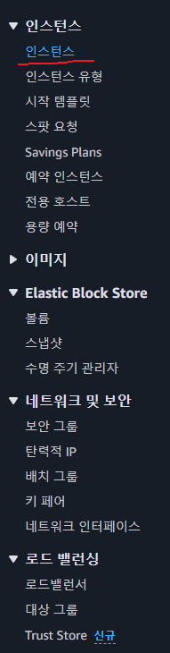
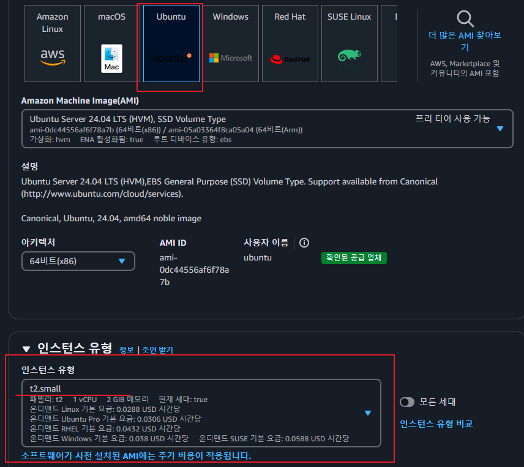
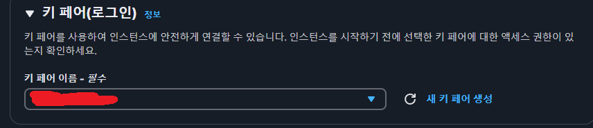
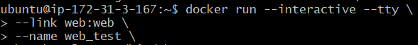

## 생성하기
   
우선 왼쪽의 인스턴스 탭에서 인스턴스를 클릭합니다   
   
그후 주황색 인스턴스 시작을 클릭합니다   
   
AMI 는 우분투로 선택하고 인스턴스 유형은 t2.small을 선택합니다.
   
생성해 놓은 키페어를 설정합니다 

그 이후에는 사진의 순서대로 실행하시면 됩니다.
   

   


   
인바운드의 규칙을 클릭 하신후 아래의 사진처럼 설정


   

## 이후 EC@ 에 도커설치

### Docker 설치 및 설정 프로세스 (AWS EC2 기준)

---

#### **1. 패키지 업데이트**
```bash
sudo apt update
```

---

#### **2. HTTPS 관련 필수 패키지 설치**
```bash
sudo apt install apt-transport-https ca-certificates curl software-properties-common
```

##### **설치된 패키지 설명**
- **`apt-transport-https`**: APT가 HTTPS 프로토콜을 통해 패키지를 다운로드 가능하도록 지원.
- **`ca-certificates`**: HTTPS 연결 시 필요한 신뢰할 수 있는 인증서를 관리.
- **`curl`**: HTTP/HTTPS 파일 전송을 위한 커맨드 라인 도구.
- **`software-properties-common`**: PPA 저장소 관리 유틸리티.

---

#### **3. Docker GPG 키 추가**
```bash
curl -fsSL https://download.docker.com/linux/ubuntu/gpg | sudo apt-key add -
```

##### **명령어 구성**
- **`curl -fsSL`**: 리다이렉션을 자동 처리하며, 오류 메시지를 생략하고 안전하게 다운로드.
- **`| sudo apt-key add -`**: 다운로드된 데이터를 APT 키로 추가.

---

#### **4. Docker 저장소 등록**
```bash
sudo add-apt-repository "deb [arch=amd64] https://download.docker.com/linux/ubuntu focal stable"
```

---

#### **5. 패키지 목록 업데이트**
```bash
sudo apt update
```

---

#### **6. Docker 설치**
```bash
sudo apt install docker-ce
```

---

#### **7. 설치 확인**
```bash
docker --version
```

---

### Docker 그룹 및 권한 설정

#### **1. 현재 사용자 그룹 확인**
```bash
sudo groups $USER
```

#### **2. Docker 그룹 생성**
```bash
sudo groupadd docker
```

#### **3. Docker 그룹에 현재 사용자 추가**
```bash
sudo usermod -a -G docker $USER
```

#### **4. Docker 그룹 추가 확인**
```bash
getent group docker
```

---

#### **5. AWS EC2 재부팅 또는 SSH 재접속**
- **EC2 재부팅**
  ```bash
  sudo reboot
  ```

- **SSH 접속 종료**
  ```bash
  exit
  ```

---

### 최종 확인
재접속 후 Docker 명령어를 루트 권한 없이 실행 가능한지 확인:
```bash
docker run hello-world
```