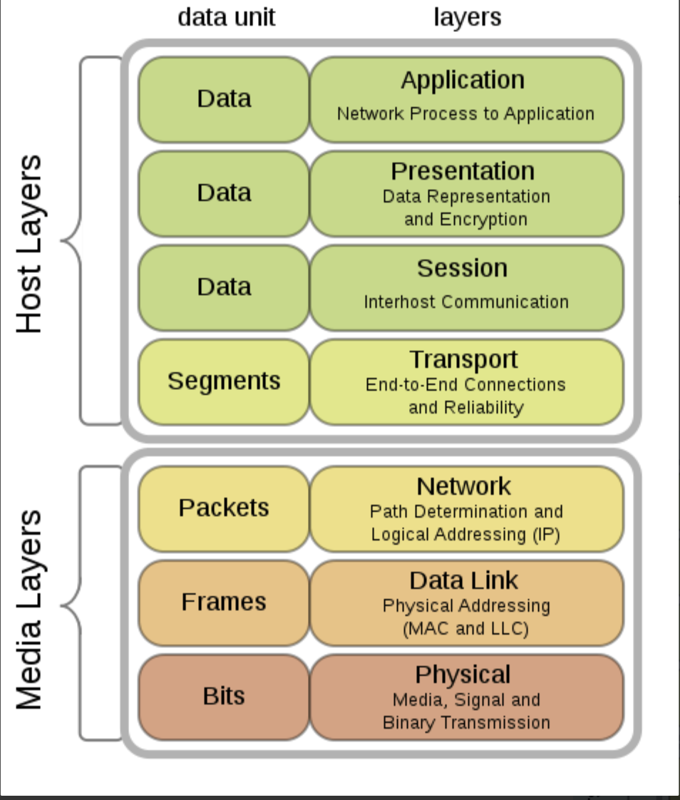
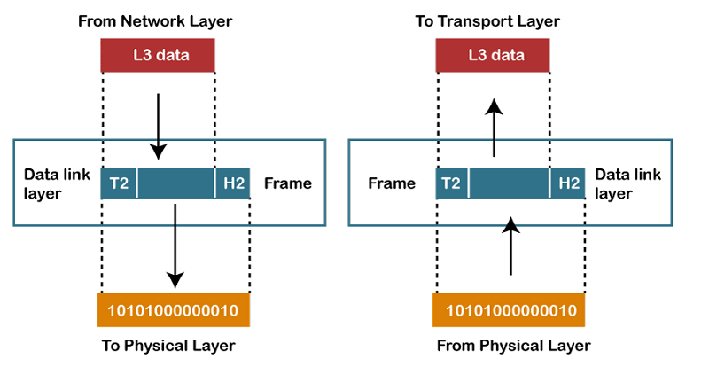
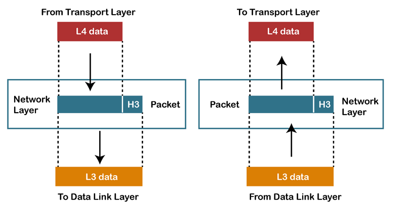
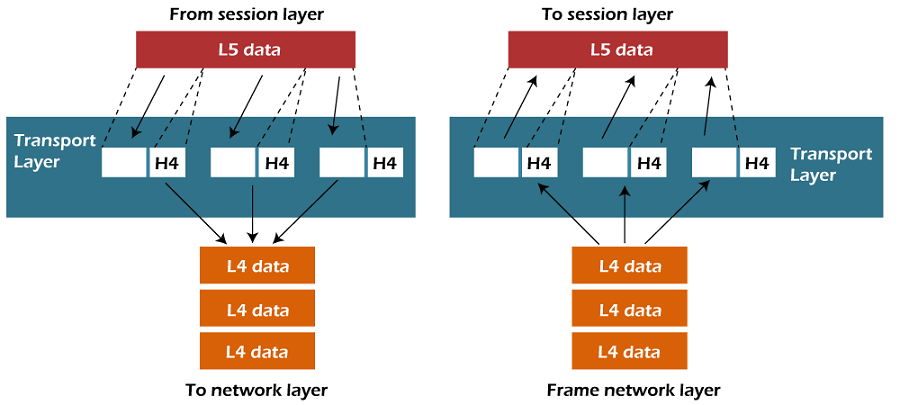
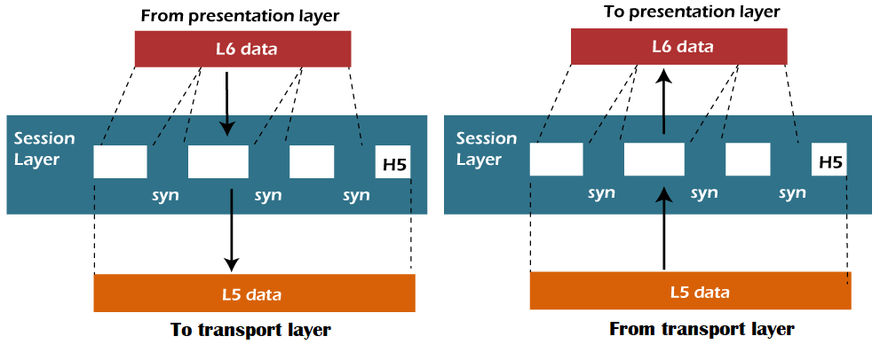

### OSI 모델 설명:

**OSI 모델(개방형 시스템 상호연결 모델)** 은 한 컴퓨터의 소프트웨어 애플리케이션에서 정보를 받아들여, 물리적 매체를 통해 다른 컴퓨터의 소프트웨어 애플리케이션으로 데이터를 어떻게 전달하는지를 설명하는 참조 모델입니다. OSI는 7개의 계층으로 구성되어 있으며, 각 계층은 네트워크 통신에서 특정한 기능을 수행합니다. OSI 모델은 1984년 국제 표준화 기구(ISO)에 의해 개발되었으며, 현재 컴퓨터 간 통신을 위한 기본적인 아키텍처 모델로 간주됩니다. 이 모델은 통신 작업을 7개의 작은 계층으로 나누어 각 계층에 고유한 작업을 할당합니다.

---
### OSI 모델의 특성:

OSI 모델은 **상위 계층**과 **하위 계층**으로 나눌 수 있습니다.

- **상위 계층**: 애플리케이션 관련 문제를 처리하는 계층으로, 소프트웨어로 구현됩니다. 상위 계층은 최종 사용자와 가장 가까운 계층입니다.
- **하위 계층**: 데이터 전송 문제를 다루며, 하드웨어 및 소프트웨어로 구현됩니다. 물리 계층과 데이터 링크 계층은 주로 하드웨어와 관련되어 있습니다.
---

### OSI 7계층과 관련된 프로토콜, 기술, 포맷:
  
1. **물리 계층 (Physical Layer)**
OSI 모델의 물리 계층(Physical Layer)의 주요 기능은 개별 비트를 하나의 노드에서 다른 노드로 전송하는 것입니다. 이 계층은 OSI 모델의 가장 낮은 계층입니다. 물리적인 연결을 설정, 유지 및 비활성화하며, 기계적, 전기적 및 절차적인 네트워크 인터페이스 사양을 지정합니다.
   - **회선 구성(Line Configuration)**: 두 개 이상의 장치를 물리적으로 어떻게 연결할지를 정의합니다.
   - **데이터 전송(Data Transmission)**: 네트워크 상에서 두 장치 간의 전송 모드(단방향, 반이중, 전이중)를 정의합니다.
   - **토폴로지(Topology)**: 네트워크 장치들이 어떻게 배열되는지를 정의합니다.
   - **신호(Signals)**: 정보를 전송하는 데 사용되는 신호의 유형을 결정합니다.
   - **기술**: 
     - Ethernet (IEEE 802.3)
     - USB (Universal Serial Bus)
     - Bluetooth
     - Wi-Fi (IEEE 802.11)
     - DSL (Digital Subscriber Line)
     - ISDN (Integrated Services Digital Network)
     - 광섬유(Fiber Optic)
   - **프로토콜**: 없음 (전송 매체나 하드웨어 관련)
   - **포맷**: 없음 (물리적 신호 전송)

2. **데이터 링크 계층 (Data-Link Layer)**
이 계층은 데이터 프레임의 오류 없는 전송을 담당합니다. 네트워크 상에서 데이터의 형식을 정의하며, 두 개 이상의 장치 간에 신뢰할 수 있고 효율적인 통신을 제공합니다. 또한 로컬 네트워크에 있는 각 장치의 고유 식별을 주로 담당합니다. 데이터 링크 계층은 두 개의 하위 계층으로 나뉩니다.

   - **논리 링크 제어 계층(Logical Link Control Layer)**  
   패킷을 수신하는 장치의 네트워크 계층으로 전송하는 역할을 합니다. 또한 헤더에서 네트워크 계층 프로토콜의 주소를 식별하고 흐름 제어를 제공합니다.
   - **매체 접근 제어 계층(Media Access Control Layer)**  
   매체 접근 제어 계층은 논리 링크 제어 계층과 네트워크의 물리 계층 사이의 링크입니다. 네트워크 상에서 패킷을 전송하는 데 사용됩니다.  

   데이터 링크 계층의 기능:
   - **프레이밍(Framing)**: 데이터 링크 계층은 물리 계층의 원시 비트 스트림을 프레임으로 알려진 패킷으로 변환합니다. 데이터 링크 계층은 프레임에 헤더와 트레일러를 추가합니다. 프레임에 추가된 헤더에는 하드웨어 목적지 주소와 출발지 주소가 포함됩니다.
   - **물리적 주소 지정(Physical Addressing)**: 데이터 링크 계층은 프레임에 목적지 주소를 포함한 헤더를 추가합니다. 프레임은 헤더에 명시된 목적지 주소로 전송됩니다.
   - **흐름 제어(Flow Control)**: 흐름 제어는 데이터 링크 계층의 주요 기능입니다. 데이터가 손상되지 않도록 양측에서 일정한 데이터 전송 속도를 유지하는 기술입니다. 처리 속도가 높은 서버와 속도가 낮은 수신 장치 간의 데이터 전송 속도가 과도하게 차이나지 않도록 보장합니다.
   - **오류 제어(Error Control)**: 오류 제어는 CRC(Cyclic Redundancy Check)와 같은 계산된 값을 데이터 링크 계층의 트레일러에 추가하여 구현됩니다. 이 트레일러는 메시지 프레임이 물리 계층으로 전송되기 전에 추가됩니다. 오류가 발생하면 수신자는 손상된 프레임의 재전송을 요청하는 확인 메시지를 보냅니다.
   - **접근 제어(Access Control)**: 두 개 이상의 장치가 동일한 통신 채널에 연결된 경우, 데이터 링크 계층 프로토콜을 사용하여 특정 시간에 어느 장치가 링크를 제어할지 결정합니다.
   - **기술**: 
     - 스위치, 브리지, 네트워크 인터페이스 카드(NIC)
   - **프로토콜**: 
     - Ethernet (IEEE 802.3)
     - PPP (Point-to-Point Protocol)
     - HDLC (High-Level Data Link Control)
     - Frame Relay
     - ATM (Asynchronous Transfer Mode)
     - ARP (Address Resolution Protocol)
     - MPLS (Multiprotocol Label Switching)
     - FDDI (Fiber Distributed Data Interface)
     - Token Ring
   - **포맷**: 프레임(Frame)
   

3. **네트워크 계층 (Network Layer)**
  
이 계층은 장치 주소 관리를 담당하며, 네트워크 상의 장치 위치를 추적합니다. 네트워크 상태, 서비스 우선순위 및 기타 요인에 따라 데이터를 출발지에서 목적지로 전송하기 위한 최적 경로를 결정합니다. 데이터 링크 계층은 패킷의 라우팅 및 전달을 담당합니다. 라우터는 계층 3 장치로, 이 계층에서 지정되며 인터네트워크 내에서 라우팅 서비스를 제공합니다. 네트워크 트래픽을 라우팅하는 데 사용되는 프로토콜은 네트워크 계층 프로토콜이라고 합니다. 예로는 IP와 IPv6가 있습니다.

네트워크 계층의 기능:
   - **인터네트워킹(Internetworking)**: 인터네트워킹은 네트워크 계층의 주요 책임입니다. 이 계층은 서로 다른 장치 간에 논리적 연결을 제공합니다.
   
   - **주소 지정(Addressing)**: 네트워크 계층은 프레임의 헤더에 출발지와 목적지 주소를 추가합니다. 주소 지정은 인터넷 상에서 장치를 식별하는 데 사용됩니다.
   
   - **라우팅(Routing)**: 라우팅은 네트워크 계층의 주요 요소로, 출발지에서 목적지까지 여러 경로 중 최적의 경로를 결정합니다.
   
   - **패킷화(Packetizing)**: 네트워크 계층은 상위 계층에서 패킷을 수신하여 이를 데이터 패킷으로 변환합니다. 이 과정은 패킷화(Packetizing)라고 하며, 인터넷 프로토콜(IP)에 의해 수행됩니다
   - **기술**: 
     - 라우터, L3 스위치
   - **프로토콜**: 
     - IP (Internet Protocol) - IPv4, IPv6
     - ICMP (Internet Control Message Protocol)
     - IGMP (Internet Group Management Protocol)
     - OSPF (Open Shortest Path First)
     - BGP (Border Gateway Protocol)
     - RIP (Routing Information Protocol)
     - IPX (Internetwork Packet Exchange)
     - X.25
     - EIGRP (Enhanced Interior Gateway Routing Protocol)
   - **포맷**: 패킷(Packet)

4. **전송 계층 (Transport Layer)**

  
전송 계층은 계층 4로, 메시지가 전송된 순서대로 전달되며 데이터 중복이 발생하지 않도록 보장합니다. 전송 계층의 주요 책임은 데이터를 완전하게 전송하는 것입니다. 상위 계층으로부터 데이터를 받아 세그먼트라고 불리는 더 작은 단위로 변환합니다. 이 계층은 출발지와 목적지 사이에 신뢰성 있는 점대점(end-to-end) 연결을 제공하므로 종단 간 계층이라고도 합니다.

   이 계층에서 사용되는 두 가지 프로토콜:
   - **전송 제어 프로토콜(TCP, Transmission Control Protocol)**  
   TCP는 인터넷 상에서 시스템 간의 통신을 가능하게 하는 표준 프로토콜입니다. TCP는 호스트 간의 연결을 설정하고 유지합니다. 데이터를 TCP 연결을 통해 전송할 때, TCP 프로토콜은 데이터를 세그먼트라는 더 작은 단위로 나눕니다. 각 세그먼트는 인터넷을 통해 다양한 경로로 전송되며, 목적지에서는 서로 다른 순서로 도착할 수 있습니다. TCP는 수신 측에서 패킷을 올바른 순서로 재정렬합니다.
   
   - **사용자 데이터그램 프로토콜(UDP, User Datagram Protocol)**  
   UDP는 전송 계층 프로토콜입니다. 수신자가 패킷을 수신했을 때 확인 응답을 보내지 않고, 송신자는 확인을 기다리지 않기 때문에 UDP는 신뢰성이 낮은 프로토콜입니다. 이 때문에 UDP는 신뢰할 수 없는 프로토콜로 간주됩니다.

   전송 계층의 기능:
   - **서비스 포인트 주소 지정(Service-point addressing)**: 컴퓨터는 여러 프로그램을 동시에 실행할 수 있기 때문에, 데이터 전송은 단순히 한 컴퓨터에서 다른 컴퓨터로 이루어지는 것이 아니라, 한 프로세스에서 다른 프로세스로도 이루어집니다. 전송 계층은 서비스 포인트 주소 또는 포트 주소라고 알려진 주소를 포함한 헤더를 추가합니다. 네트워크 계층의 책임은 데이터를 한 컴퓨터에서 다른 컴퓨터로 전송하는 것이고, 전송 계층의 책임은 메시지를 올바른 프로세스로 전달하는 것입니다.

   - **세그먼트화 및 재조립(Segmentation and reassembly)**: 전송 계층은 상위 계층으로부터 메시지를 수신하면 이를 여러 세그먼트로 나누고, 각 세그먼트에 고유한 순서 번호를 부여합니다. 메시지가 목적지에 도착하면 전송 계층은 이 순서 번호를 기준으로 메시지를 재조립합니다.

   - **연결 제어(Connection control)**: 전송 계층은 두 가지 서비스를 제공합니다: 연결 지향 서비스(connection-oriented service)와 비연결 서비스(connectionless service). 비연결 서비스는 각 세그먼트를 개별 패킷으로 처리하여 각기 다른 경로를 통해 목적지로 전송합니다. 연결 지향 서비스는 패킷을 전달하기 전에 목적지 장치의 전송 계층과 연결을 설정하며, 이 서비스에서는 모든 패킷이 단일 경로를 통해 이동합니다.

   - **흐름 제어(Flow control)**: 전송 계층은 흐름 제어를 담당하지만, 이는 개별 링크가 아닌 종단 간(end-to-end)으로 수행됩니다.

   - **오류 제어(Error control)**: 전송 계층은 오류 제어도 담당합니다. 오류 제어는 개별 링크가 아닌 종단 간(end-to-end)으로 수행됩니다. 송신 측 전송 계층은 메시지가 오류 없이 목적지에 도착하도록 보장합니다.
   - **기술**: 
     - (주로 소프트웨어 기반으로 관리됨)
   - **프로토콜**: 
     - TCP (Transmission Control Protocol)
     - UDP (User Datagram Protocol)
     - SCTP (Stream Control Transmission Protocol)
     - DCCP (Datagram Congestion Control Protocol)
     - SPX (Sequenced Packet Exchange)
   - **포맷**: 세그먼트(Segment)

5. **세션 계층 (Session Layer)**
  
세션 계층은 OSI 모델에서 계층 5에 해당합니다. 세션 계층은 통신하는 장치 간의 상호작용을 설정, 유지 및 동기화하는 데 사용됩니다.

세션 계층의 기능:
   - **대화 제어(Dialog control)**: 세션 계층은 대화 제어자로 작동하여 두 프로세스 간의 대화를 생성합니다. 다시 말해, 두 프로세스 간의 통신을 허용하며, 이는 반이중(half-duplex) 또는 전이중(full-duplex) 방식일 수 있습니다.

   - **동기화(Synchronization)**: 세션 계층은 데이터를 순차적으로 전송할 때 몇 가지 체크포인트를 추가합니다. 데이터 전송 중간에 오류가 발생하면, 전송은 체크포인트부터 다시 시작됩니다. 이 과정을 동기화(Synchronization)라고 합니다.

   - **기술**: 
     - (주로 소프트웨어 기반)
   - **프로토콜**: 
     - NetBIOS (Network Basic Input/Output System)
     - PPTP (Point-to-Point Tunneling Protocol)
     - L2TP (Layer 2 Tunneling Protocol)
     - RPC (Remote Procedure Call)
     - SMB (Server Message Block)
   - **포맷**: 없음

6. **표현 계층 (Presentation Layer)**
  
표현 계층은 두 시스템 간에 교환되는 정보의 구문(syntax)과 의미(semantics)에 중점을 둡니다. 이 계층은 네트워크를 위한 데이터 변환기로 작동합니다. 운영 체제의 일부로, 데이터를 한 표현 형식에서 다른 형식으로 변환하는 역할을 합니다. 표현 계층은 구문 계층(syntax layer)이라고도 불립니다.

표현 계층의 기능:
   - **번역(Translation)**: 두 시스템의 프로세스는 문자, 숫자 등의 형태로 정보를 교환합니다. 서로 다른 컴퓨터는 서로 다른 인코딩 방식을 사용하므로, 표현 계층은 이러한 인코딩 방식 간의 상호운용성을 처리합니다. 송신자에 종속된 형식의 데이터를 공통 형식으로 변환하고, 수신 측에서 다시 공통 형식을 수신자에 종속된 형식으로 변환합니다.
   
   - **암호화(Encryption)**: 암호화는 개인정보 보호를 위해 필요합니다. 암호화는 송신자가 전송하는 정보를 다른 형태로 변환하여 네트워크 상으로 전송하는 과정입니다.
   
   - **압축(Compression)**: 데이터 압축은 데이터를 압축하여 전송해야 할 비트 수를 줄이는 과정입니다. 데이터 압축은 텍스트, 오디오, 비디오와 같은 멀티미디어에서 매우 중요합니다.
   - **기술**: 
     - 암호화 및 데이터 변환 기술
   - **프로토콜**: 
     - SSL (Secure Sockets Layer)
     - TLS (Transport Layer Security)
   - **포맷**: 
     - JPEG, MPEG, GIF, PNG (미디어 포맷)
     - ASCII (텍스트 인코딩)
     - EBCDIC (텍스트 인코딩)

7. **응용 계층 (Application Layer)**
  
응용 계층은 사용자와 응용 프로세스가 네트워크 서비스를 이용할 수 있도록 창구 역할을 합니다. 네트워크 투명성, 자원 할당 등의 문제를 처리합니다. 응용 계층은 특정 응용 프로그램을 의미하지 않으며, 응용 계층의 기능을 수행합니다. 이 계층은 최종 사용자에게 네트워크 서비스를 제공합니다.

응용 계층의 기능:
   - **파일 전송, 접근 및 관리(FTAM, File Transfer, Access, and Management)**: 응용 계층은 사용자가 원격 컴퓨터의 파일에 접근하고, 파일을 검색하거나 원격 컴퓨터에서 파일을 관리할 수 있는 기능을 제공합니다.
   
   - **메일 서비스(Mail services)**: 응용 계층은 이메일 전달 및 저장 기능을 제공합니다.
   
   - **디렉토리 서비스(Directory services)**: 응용 계층은 분산 데이터베이스 소스를 제공하며, 다양한 객체에 대한 전역 정보를 제공하는 데 사용됩니다.

   - **기술**: 
     - 다양한 네트워크 애플리케이션 (웹 브라우저, 이메일 클라이언트 등)
   - **프로토콜**: 
     - HTTP (Hypertext Transfer Protocol)
     - HTTPS (HTTP Secure)
     - FTP (File Transfer Protocol)
     - SMTP (Simple Mail Transfer Protocol)
     - POP3 (Post Office Protocol)
     - IMAP (Internet Message Access Protocol)
     - DNS (Domain Name System)
     - DHCP (Dynamic Host Configuration Protocol)
     - Telnet
     - SNMP (Simple Network Management Protocol)
     - LDAP (Lightweight Directory Access Protocol)
     - SIP (Session Initiation Protocol)
     - SSH (Secure Shell)
     - NFS (Network File System)
     - RTP (Real-time Transport Protocol)
   - **포맷**: (응용 계층은 데이터 형식보다는 상위 프로토콜을 통해 통신)

---

### OSI 모델의 각 계층 요약 기능:

- **물리 계층**: 전기적 신호로 데이터를 전송.
- **데이터 링크 계층**: 프레임을 통해 인접 장치 간 신뢰성 있는 전송.
- **네트워크 계층**: 패킷을 통해 네트워크 경로 설정 및 데이터 전송.
- **전송 계층**: 세그먼트를 통해 신뢰성 있는 데이터 전송.
- **세션 계층**: 데이터 송수신 간의 세션 설정 및 관리.
- **표현 계층**: 데이터의 암호화, 압축, 형식 변환.
- **응용 계층**: 사용자와 애플리케이션이 네트워크 서비스를 사용할 수 있게 함.

