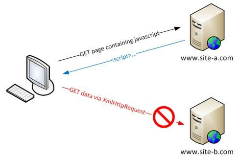

### 1. HTTP와 웹의 동작 방식

#### 1.1. HTTP 프로토콜
**HTTP(Hypertext Transfer Protocol)**는 클라이언트(웹 브라우저)와 서버 간에 데이터를 주고받기 위한 프로토콜입니다. HTTP 요청은 주로 서버에서 리소스나 데이터를 요청하는 것이며, 서버는 이에 대한 응답을 반환합니다. 이 프로세스는 기본적으로 비상태적(stateless)이며, 각 요청은 독립적입니다.

#### 1.2. HTTP 요청과 응답의 구성
- **HTTP 메소드**: 클라이언트가 서버에 어떤 작업을 요청할지를 결정하는 방식입니다. 주요 메소드로는 `GET`, `POST`, `PUT`, `DELETE`, `OPTIONS`가 있습니다.
- **URL**: 요청하려는 리소스의 위치를 나타냅니다.
- **헤더**: 클라이언트와 서버 간에 부가 정보를 전달하는 메타데이터로, 쿠키, 인증 정보, 요청 유형 등을 포함합니다.
- **본문(Body)**: 서버로 전송되는 데이터입니다. 주로 `POST` 요청에서 양식 데이터를 전송할 때 사용됩니다.

응답도 비슷하게 상태 코드, 헤더, 본문으로 구성됩니다. 예를 들어, 상태 코드 `200 OK`는 요청이 성공적으로 처리되었음을 의미합니다.

---

### 2. Same-Origin Policy(동일 출처 정책)
 출처 :https://www.linkedin.com/pulse/same-origin-policy-sop-behnam-yazdanpanah
#### 2.1. 출처(Origin)란?
**출처(Origin)**는 웹 페이지의 **프로토콜(HTTP/HTTPS)**, **호스트(도메인)**, **포트 번호**의 조합을 의미합니다. 동일 출처 정책은 한 웹 페이지가 로드된 출처와 다른 출처의 리소스에 접근하는 것을 제한하는 보안 메커니즘입니다.

#### 2.2. 동일 출처 정책의 필요성
Same-Origin Policy는 보안을 강화하기 위해 도입되었습니다. 이를 통해 **크로스사이트 스크립팅(XSS)**이나 **CSRF(Cross-Site Request Forgery)** 같은 공격을 방지할 수 있습니다. 웹 페이지가 자신이 속한 출처 내에서만 자원을 요청할 수 있도록 하여 다른 출처의 민감한 데이터에 접근하는 것을 차단합니다.

#### 2.3. 출처를 어떻게 판단하는가?
출처는 세 가지 요소로 결정됩니다:
- **프로토콜(Protocol)**: 예를 들어, `http://example.com`과 `https://example.com`은 서로 다른 출처입니다.
- **도메인(Domain)**: `http://example.com`과 `http://api.example.com`도 도메인이 다르므로 다른 출처로 간주됩니다.
- **포트(Port)**: `http://example.com:80`과 `http://example.com:8080`은 포트가 다르면 서로 다른 출처로 간주됩니다.

#### 2.4. 제한 사항
동일 출처 정책에 의해 다음과 같은 접근이 제한됩니다:
- **AJAX 요청**: XHR(XMLHttpRequest)나 Fetch API를 통해 다른 출처의 리소스에 접근하는 것을 제한합니다.
- **DOM 접근**: 다른 출처의 웹 페이지나 요소에 접근하는 것을 차단합니다.
- **쿠키**: 다른 출처의 쿠키나 인증 정보를 읽거나 설정하는 것도 제한됩니다.

---

### 3. Cross-Origin(크로스 오리진) 요청
  출처: MDN - CORS
#### 3.1. 크로스 오리진이란?
**크로스 오리진(Cross-Origin)**은 **다른 출처**에서 리소스를 요청하는 상황을 말합니다. 동일 출처 정책은 보안을 강화하지만, 현실적으로는 다양한 출처에서 데이터를 요청할 필요가 있습니다. 이때 브라우저는 보안 정책에 따라 **크로스 오리진 요청**을 기본적으로 차단하며, 서버에서 명시적으로 허용해야만 요청을 처리할 수 있습니다.

#### 3.2. 크로스 오리진 요청의 필요성
현대 웹 애플리케이션에서는 여러 출처의 리소스에 접근할 필요가 있습니다. 예를 들어:
- **프론트엔드와 백엔드 서버 분리**: 프론트엔드 서버(`http://frontend.com`)와 백엔드 API 서버(`http://api.backend.com`)가 분리되어 있을 경우, 프론트엔드에서 백엔드 API에 데이터를 요청하는 것은 **크로스 오리진 요청**이 됩니다.
- **외부 API 호출**: Google Maps API, 결제 시스템 등의 외부 API를 사용할 때도 크로스 오리진 요청이 발생합니다.

이런 요청을 허용하려면 서버가 명시적으로 허가해야 하며, 이를 위해 **CORS(Cross-Origin Resource Sharing)**가 사용됩니다.

---

### 4. CORS(Cross-Origin Resource Sharing)

#### 4.1. CORS란?
**CORS**는 서버가 **크로스 오리진 요청**을 허용할지 여부를 결정할 수 있는 메커니즘입니다. 서버는 응답 헤더에 **Access-Control-Allow-Origin** 같은 CORS 관련 정보를 포함시켜 클라이언트(브라우저)에게 요청이 허용되었음을 알립니다.

#### 4.2. CORS 동작 원리
1. **클라이언트 요청**: 클라이언트(브라우저)가 다른 출처의 리소스를 요청하면, 브라우저는 서버로 CORS 요청을 보냅니다.
2. **서버 응답**: 서버는 응답 헤더에 `Access-Control-Allow-Origin` 등의 CORS 관련 헤더를 포함하여 클라이언트가 이 요청을 허용할 수 있는지 응답합니다.
3. **PreFlight 요청**: 만약 요청이 단순하지 않을 경우(POST, PUT, DELETE와 같은 메소드 사용, 커스텀 헤더 포함 등), 브라우저는 **PreFlight 요청**을 통해 서버가 요청을 허용할지 먼저 확인합니다. 이때 HTTP 메소드 `OPTIONS`가 사용됩니다.

---

### 5. PreFlight 요청

#### 5.1. PreFlight 요청이란?
**PreFlight 요청**은 브라우저가 크로스 오리진 요청을 보내기 전에 서버에 보내는 사전 요청입니다. 이 요청을 통해 서버가 실제 요청을 허용할지 여부를 미리 확인할 수 있습니다. PreFlight 요청은 일반적으로 **OPTIONS 메소드**를 사용하여 이루어집니다.

#### 5.2. PreFlight 요청의 흐름
1. **클라이언트가 PreFlight 요청을 보냄**: 브라우저는 서버에 `OPTIONS` 메소드로 PreFlight 요청을 보냅니다. 이 요청에는 허용된 메소드와 헤더를 확인하기 위한 `Access-Control-Request-Method`, `Access-Control-Request-Headers`, `Origin` 헤더가 포함됩니다.
   
   예시:
   ```
   OPTIONS /api/resource HTTP/1.1
   Host: api.example.com
   Origin: http://frontend.com
   Access-Control-Request-Method: POST
   Access-Control-Request-Headers: Content-Type
   ```

2. **서버가 PreFlight 응답을 보냄**: 서버는 허용된 메소드, 헤더, 출처 등을 응답에 포함하여 클라이언트가 이 요청을 허용할 수 있는지 알려줍니다.
   
   예시:
   ```
   HTTP/1.1 200 OK
   Access-Control-Allow-Origin: http://frontend.com
   Access-Control-Allow-Methods: POST, GET
   Access-Control-Allow-Headers: Content-Type
   ```

3. **실제 요청**: PreFlight 요청이 성공적으로 처리되면, 브라우저는 실제 HTTP 요청(GET, POST 등)을 전송합니다.

---

### 6. CORS와 크로스 오리진 관련 헤더

CORS 요청과 관련된 주요 헤더는 다음과 같습니다:
- **Access-Control-Allow-Origin**: 허용할 출처를 명시합니다. `*`는 모든 출처를 허용하는 것이지만, 보안상 좋지 않은 설정입니다.
- **Access-Control-Allow-Methods**: 허용할 HTTP 메소드를 지정합니다. 예를 들어, `GET`, `POST`, `PUT` 등을 허용할 수 있습니다.
- **Access-Control-Allow-Headers**: 클라이언트에서 사용할 수 있는 요청 헤더를 명시합니다. 예를 들어, `Content-Type`, `Authorization`과 같은 커스텀 헤더를 허용할 수 있습니다.
- **Access-Control-Allow-Credentials**: 자격 증명(쿠키나 인증 정보)을 포함한 요청을 허용할지 여부를 설정합니다.
- **Access-Control-Max-Age**: PreFlight 요청의 응답을 브라우저가 캐시하는 시간을 지정합니다. 이 값이 설정되면 해당 시간 동안 다시 PreFlight 요청을 보내지 않습니다.

---

### 7. 관련된 추가 개념

#### 7.1.

 CSRF(Cross-Site Request Forgery)
CSRF는 공격자가 사용자의 권한을 가로채서 다른 출처의 요청을 위조하는 공격입니다. 예를 들어, 사용자가 로그인한 상태에서 공격자가 조작한 요청을 보내 피해를 줄 수 있습니다. CORS는 이러한 공격을 방지하기 위해 자격 증명(쿠키, 세션 등)을 포함한 요청에 대해 서버가 명시적으로 허용하는지 확인하는 메커니즘을 가지고 있습니다.

#### 7.2. JSONP(JSON with Padding)
CORS가 도입되기 전에는 **JSONP**라는 기술이 크로스 오리진 요청을 처리하는 데 사용되었습니다. JSONP는 `script` 태그를 사용하여 외부에서 JSON 데이터를 불러오는 방식이었습니다. 하지만 POST 요청을 지원하지 않고 보안상 취약점이 있어 현재는 CORS로 대체되었습니다.

---

### 8. 실제로 적용하기

#### 서버에서 CORS 설정 예시

- **Node.js + Express**
   ```javascript
   const express = require('express');
   const app = express();

   app.use((req, res, next) => {
     res.header('Access-Control-Allow-Origin', '*'); // 모든 출처 허용
     res.header('Access-Control-Allow-Methods', 'GET, POST, PUT, DELETE');
     res.header('Access-Control-Allow-Headers', 'Content-Type, Authorization');
     next();
   });

   app.get('/api/resource', (req, res) => {
     res.json({ message: 'CORS 설정 성공' });
   });

   app.listen(3000, () => console.log('서버가 3000 포트에서 실행 중'));
   ```

- **Spring Boot**
   ```java
   @RestController
   @CrossOrigin(origins = "http://frontend.com")
   public class MyController {
   
       @GetMapping("/api/resource")
       public String getResource() {
           return "CORS 설정 성공";
       }
   }
   ```

