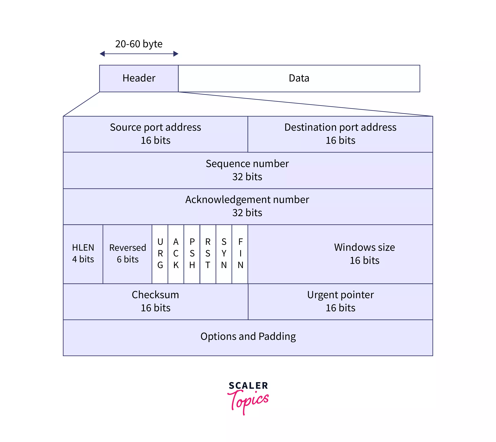

TCP 프로토콜은 인터넷에서 데이터를 신뢰성 있게 전송하기 위해 사용되는 핵심 프로토콜입니다. 이 글은 TCP 프로토콜의 동작 방식과 관련된 여러 개념을 다루고 있으며, 이를 더 쉽게 이해하고 자세히 설명하겠습니다.

### TCP Packet

TCP 패킷은 데이터를 송수신하는 단위입니다. 각 TCP 패킷에는 **헤더**와 **데이터**가 포함됩니다. 헤더에는 데이터를 신뢰성 있게 전송하기 위한 여러 필드가 포함되며, 대표적으로 **시퀀스 넘버(Sequence Number)**, **확인 응답 번호(Acknowledgment Number)**, **제어 플래그(Flags)** 등이 있습니다. 이들 필드는 패킷의 순서, 송신 및 수신 상태를 관리하고, 연결 설정과 종료를 제어하는 데 사용됩니다.

### Connection Establishment (연결 설정)

TCP는 **3-way 핸드셰이크**라는 과정을 통해 연결을 설정합니다. 이 과정은 클라이언트와 서버가 서로 연결을 준비하고 있음을 확인하는 과정으로, 다음 3단계로 이루어집니다.

1. **SYN**: 클라이언트가 서버에게 연결 요청을 위해 **SYN** 플래그가 설정된 패킷을 보냅니다. 이때, 클라이언트는 자신의 **시퀀스 넘버(ISN: Initial Sequence Number)**를 설정하여 서버에게 보냅니다.
   
2. **SYN-ACK**: 서버는 클라이언트의 요청을 받고, 자신의 **시퀀스 넘버(ISN)**를 포함한 **SYN-ACK** 패킷을 클라이언트에게 보냅니다. 이 패킷은 클라이언트의 요청을 수락했음을 의미합니다.

3. **ACK**: 클라이언트는 서버의 응답을 확인한 후, 서버에게 **ACK** 패킷을 보내 연결을 확정 짓습니다.

이 과정을 통해 TCP 연결이 설정됩니다. 이후, 실제 데이터 전송이 시작되며, 데이터 전송 중에는 3-way 핸드셰이크 과정을 반복하지 않습니다.

### Data Transfer (데이터 전송)

데이터 전송 과정에서는 **송신 측**이 데이터를 전송하고 **수신 측**이 해당 데이터를 확인한 후 **ACK** 패킷을 보내는 형태로 이루어집니다. 이는 데이터 전송 중 신뢰성을 보장하기 위해 이루어지는 과정입니다.

- **데이터 전송**: 송신 측이 수신 측에게 데이터를 보내며, 각 데이터 패킷에는 **시퀀스 넘버**가 할당됩니다.
- **ACK 응답**: 수신 측은 데이터를 정상적으로 수신하면, 해당 데이터를 확인했다는 의미로 **ACK** 패킷을 보냅니다. ACK 패킷에는 다음에 수신할 **시퀀스 넘버**가 포함됩니다.

이러한 과정에서 **패킷 손실**이나 **오류**가 발생하면, 송신 측은 해당 패킷을 재전송하여 신뢰성 있는 데이터 전송을 보장합니다.

### Sequence Number (시퀀스 넘버)

**시퀀스 넘버**는 TCP에서 매우 중요한 역할을 합니다. 이 숫자는 송신되는 각 패킷에 고유하게 할당되며, 데이터의 순서를 보장하고 손실된 패킷을 식별하는 데 사용됩니다.

1. **데이터 순서 보장**: 시퀀스 넘버는 패킷이 수신 측에서 올바른 순서로 재조립될 수 있도록 합니다.
2. **데이터 무결성**: 패킷이 손실되거나 순서가 잘못된 경우, 수신 측은 시퀀스 넘버를 통해 이를 감지하고 송신 측에 재전송을 요청할 수 있습니다.
3. **중복 데이터 제거**: 이미 수신된 시퀀스 넘버의 데이터를 다시 받을 경우, 수신 측은 이를 무시합니다.
4. **흐름 제어 및 혼잡 제어**: 시퀀스 넘버를 사용하여 네트워크의 혼잡 상태를 모니터링하고, 데이터 전송 속도를 조절할 수 있습니다.

### Acknowledgment Number (ACK 번호)

**ACK 번호**는 수신 측이 다음에 수신할 것으로 기대하는 데이터의 **시퀀스 넘버**를 나타냅니다. 이를 통해 송신 측은 자신이 보낸 데이터가 정상적으로 도착했는지 확인할 수 있습니다.

예를 들어, 송신 측이 시퀀스 넘버 1부터 100바이트의 데이터를 전송했으면, 수신 측은 **ACK 번호** 101을 송신 측에게 보냅니다. 이는 "1~100번까지의 데이터를 잘 받았고, 이제 101번 데이터를 보내달라"는 의미입니다.

### Connection Termination (연결 종료)

TCP 연결 종료는 **4-way 핸드셰이크**라는 절차를 통해 이루어집니다. 이는 연결 설정과 유사하지만, 양쪽에서 독립적으로 연결을 끊을 수 있습니다.

1. **FIN**: 연결을 종료하고자 하는 쪽(예: 클라이언트)이 **FIN** 패킷을 보내면서 연결 종료를 시작합니다.
2. **ACK**: 수신 측(서버)은 FIN 패킷을 받으면 이에 대한 **ACK** 응답을 보냅니다.
3. **FIN**: 서버도 자신의 데이터를 모두 전송한 후 **FIN** 패킷을 클라이언트에게 보냅니다.
4. **ACK**: 클라이언트는 서버의 FIN 패킷을 받은 후, **ACK**를 보내 연결을 종료합니다.

### Head-of-line (HOL) Blocking

**TCP**는 데이터를 순차적으로 전송하고, 수신 측도 이를 순차적으로 처리해야 합니다. 만약 중간에 패킷이 손실되거나 지연되면, 이후에 도착한 패킷들도 처리되지 못하고 대기하게 됩니다. 이로 인해 **HOL Blocking**이라는 문제가 발생할 수 있습니다.

이 문제는 **HTTP/1.1**의 **파이프라이닝(pipelining)** 방식에서 특히 두드러집니다. 파이프라이닝에서는 여러 요청을 한 번에 보낼 수 있지만, 응답은 순서대로 처리되기 때문에 하나의 요청이 지연되면 나머지 요청도 지연됩니다.

### Multiplexing in HTTP/2 and TCP Layer Blocking

**HTTP/2**에서는 **멀티플렉싱(multiplexing)**을 도입하여 HOL Blocking 문제를 완화했습니다. 여러 요청과 응답이 순서에 상관없이 동시에 처리될 수 있도록 하는 방식입니다. 하지만 **TCP**의 **헤드 오브 라인 블로킹** 문제는 여전히 존재합니다. 이는 TCP가 패킷의 순서를 보장하기 위해 순서대로 데이터를 전송하고, 패킷 손실 시 모든 후속 패킷도 대기해야 하기 때문입니다.

이 문제를 해결하기 위해, **HTTP/3**에서는 **QUIC**이라는 새로운 전송 프로토콜을 도입했습니다. **QUIC**은 **UDP** 기반으로 동작하여 패킷이 손실되더라도 개별 스트림에만 영향을 미치고, 다른 스트림의 전송에는 영향을 주지 않도록 설계되었습니다.

### 결론

TCP는 데이터의 신뢰성과 순서를 보장하는 매우 중요한 프로토콜입니다. 하지만, 이를 위해 순차적인 데이터 처리 방식 때문에 **HOL Blocking**과 같은 문제가 발생할 수 있습니다. 이러한 문제를 해결하기 위해 **HTTP/2**에서는 멀티플렉싱을, **HTTP/3**에서는 **QUIC** 프로토콜을 도입하여 네트워크 성능을 개선하고자 했습니다.