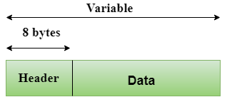
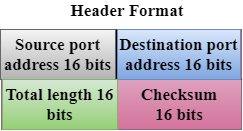

### TCP/IP 모델과 OSI 7계층 비교

## TCP/IP 모델  
TCP/IP 모델은 OSI 모델보다 먼저 개발되었습니다. TCP/IP 모델은 OSI 모델과 정확히 일치하지 않습니다. TCP/IP 모델은 응용 계층, 전송 계층, 네트워크 계층, 데이터 링크 계층 및 물리 계층의 다섯 개 계층으로 구성되어 있습니다. 처음 네 개의 계층은 물리 표준, 네트워크 인터페이스, 인터네트워킹 및 전송 기능을 제공하며, 이는 OSI 모델의 첫 네 개 계층에 해당합니다. 이 네 개의 계층은 TCP/IP 모델에서 단일 계층인 응용 계층으로 표현됩니다.  
TCP/IP는 계층적 프로토콜로, 상호작용하는 모듈로 구성되어 있으며 각각 특정 기능을 제공합니다. 여기서 계층적이라는 의미는 각 상위 계층 프로토콜이 두 개 이상의 하위 계층 프로토콜에 의해 지원된다는 것입니다.

### TCP/IP 계층의 기능

#### 네트워크 액세스 계층  
네트워크 계층은 TCP/IP 모델의 가장 낮은 계층입니다. 네트워크 계층은 OSI 참조 모델에서 정의된 물리 계층과 데이터 링크 계층의 결합입니다. 이 계층은 데이터가 물리적으로 네트워크를 통해 전송되는 방식을 정의합니다. 이 계층은 동일한 네트워크 상에서 두 장치 간의 데이터 전송을 주로 담당합니다. 이 계층에서 수행되는 기능은 네트워크에서 전송되는 IP 데이터그램을 프레임에 캡슐화하고, IP 주소를 물리 주소로 매핑하는 것입니다. 이 계층에서 사용되는 프로토콜로는 이더넷, 토큰 링, FDDI, X.25, 프레임 릴레이 등이 있습니다.

#### 인터넷 계층  
인터넷 계층은 TCP/IP 모델의 두 번째 계층입니다. 인터넷 계층은 네트워크 계층이라고도 불립니다. 인터넷 계층의 주요 책임은 네트워크에서 패킷을 전송하여, 경로와 상관없이 목적지에 도달하게 하는 것입니다. 이 계층에서 사용되는 프로토콜은 다음과 같습니다.

- **IP 프로토콜**: IP 프로토콜은 이 계층에서 사용되며, TCP/IP 스위트 전체에서 가장 중요한 부분입니다.

IP 프로토콜의 책임은 다음과 같습니다:
  - **IP 주소 지정**: 이 프로토콜은 IP 주소라고 알려진 논리적 호스트 주소를 구현합니다. IP 주소는 인터넷 및 상위 계층에서 장치를 식별하고, 인터네트워크 라우팅을 제공합니다.
  - **호스트 간 통신**: 데이터가 전송될 경로를 결정합니다.
  - **데이터 캡슐화 및 포맷팅**: IP 프로토콜은 전송 계층 프로토콜로부터 데이터를 수신합니다. IP 프로토콜은 데이터가 안전하게 전송되고 수신되도록 보장하며, 데이터를 IP 데이터그램이라는 메시지로 캡슐화합니다.
  - **단편화 및 재조립**: 데이터 링크 계층 프로토콜에 의해 IP 데이터그램 크기에 부과된 제한을 최대 전송 단위(MTU)라고 합니다. IP 데이터그램 크기가 MTU 단위보다 크면, IP 프로토콜은 데이터그램을 더 작은 단위로 나누어 로컬 네트워크를 통해 전송할 수 있게 합니다. 단편화는 송신자나 중간 라우터에 의해 수행될 수 있습니다. 수신 측에서는 모든 단편을 재조립하여 원본 메시지를 만듭니다.
  - **라우팅**: 동일한 로컬 네트워크(LAN, MAN, WAN)에서 IP 데이터그램을 전송할 때 이를 직접 전달(direct delivery)이라고 합니다. 출발지와 목적지가 먼 네트워크에 있을 때는, IP 데이터그램을 라우터와 같은 다양한 장치를 통해 간접적으로 전달합니다.

- **ARP 프로토콜**: ARP는 주소 확인 프로토콜(Address Resolution Protocol)의 약자입니다. ARP는 IP 주소로부터 물리적 주소를 찾는 데 사용되는 네트워크 계층 프로토콜입니다.
  - **ARP 요청**: 송신자가 장치의 물리적 주소를 알고 싶을 때, 네트워크에 ARP 요청을 브로드캐스트합니다.
  - **ARP 응답**: 네트워크에 연결된 모든 장치가 ARP 요청을 수신하고 처리하지만, IP 주소를 인식하는 수신 장치만이 자신의 물리적 주소를 ARP 응답의 형태로 회신합니다.

- **ICMP 프로토콜**: ICMP는 인터넷 제어 메시지 프로토콜(Internet Control Message Protocol)의 약자입니다. ICMP는 송신자에게 데이터그램 문제에 대한 알림을 보내기 위해 호스트 또는 라우터가 사용하는 메커니즘입니다.

#### 전송 계층  
전송 계층은 네트워크에서 전송되는 데이터의 신뢰성, 흐름 제어 및 오류 수정을 담당합니다. 이 계층에서 사용되는 두 가지 프로토콜은 **UDP(사용자 데이터그램 프로토콜)**와 **TCP(전송 제어 프로토콜)**입니다.

- **UDP(사용자 데이터그램 프로토콜)**: UDP는 연결 없는 서비스와 종단 간 데이터 전송을 제공합니다. 신뢰할 수 없는 프로토콜로, 오류를 발견하지만 구체적으로 알리지는 않습니다. UDP는 오류를 감지하고, ICMP 프로토콜이 손상된 데이터그램에 대한 오류를 송신자에게 보고합니다.

  - **TCP(전송 제어 프로토콜)**: TCP는 응용 프로그램에 완전한 전송 계층 서비스를 제공합니다. TCP는 송신자와 수신자 간에 가상 회선을 설정하며, 전송이 완료될 때까지 활성 상태를 유지합니다. TCP는 신뢰할 수 있는 프로토콜로, 오류를 감지하고 손상된 프레임을 재전송합니다.

#### 응용 계층  
응용 계층은 TCP/IP 모델에서 가장 상위 계층입니다. 이 계층은 고수준 프로토콜을 처리하며, 표현 문제를 다룹니다. 이 계층은 사용자가 응용 프로그램과 상호작용할 수 있도록 합니다. 주요 프로토콜은 다음과 같습니다:
- **HTTP**: HTTP는 하이퍼텍스트 전송 프로토콜로, 전 세계 웹에서 데이터를 액세스할 수 있게 합니다.
- **SNMP**: SNMP는 간단한 네트워크 관리 프로토콜로, 인터넷 상의 장치를 관리하는 데 사용됩니다.
- **SMTP**: SMTP는 간단한 메일 전송 프로토콜로, 이메일을 지원하는 TCP/IP 프로토콜입니다.
- **DNS**: DNS는 도메인 이름 시스템으로, 사람들은 주소 대신 이름을 사용하기 때문에 이를 주소로 매핑하는 시스템입니다.
- **TELNET**: TELNET은 원격 시스템의 터미널로 로컬 컴퓨터와 원격 컴퓨터 간의 연결을 설정합니다.
- **FTP**: FTP는 파일 전송 프로토콜로, 한 컴퓨터에서 다른 컴퓨터로 파일을 전송하는 표준 인터넷 프로토콜입니다.