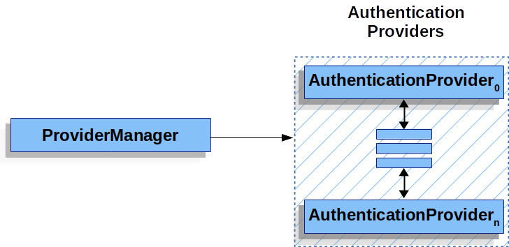

### 서블릿 인증 아키텍처

이 논의는 서블릿 보안의 전반적인 그림을 확장하여 서블릿 인증에서 Spring Security에서 사용되는 주요 아키텍처 구성 요소를 설명합니다.

- **SecurityContextHolder** - SecurityContextHolder는 Spring Security가 인증된 사용자의 세부 정보를 저장하는 곳입니다.
- **SecurityContext** - SecurityContextHolder에서 가져오며 현재 인증된 사용자의 Authentication을 포함합니다.
- **Authentication** - AuthenticationManager에 사용자 자격 증명을 제공하기 위한 입력으로 사용할 수도 있으며 SecurityContext에서 현재 사용자를 나타낼 수도 있습니다.
- **GrantedAuthority** - Authentication의 주체에게 부여된 권한(예: 역할, 범위 등)을 나타냅니다.
- **AuthenticationManager** - Spring Security의 필터가 인증을 수행하는 방법을 정의하는 API입니다.
- **ProviderManager** - AuthenticationManager의 가장 일반적인 구현입니다.
- **AuthenticationProvider** - 특정 유형의 인증을 수행하기 위해 ProviderManager에서 사용됩니다.
- **Request Credentials with AuthenticationEntryPoint** - 클라이언트로부터 자격 증명을 요청하는 데 사용됩니다(예: 로그인 페이지로 리디렉션, WWW-Authenticate 응답 전송 등).
- **AbstractAuthenticationProcessingFilter** - 인증에 사용되는 기본 필터로, 인증의 상위 흐름과 구성 요소들이 어떻게 작동하는지 잘 보여줍니다.

### SecurityContextHolder

Spring Security의 인증 모델의 핵심에는 SecurityContextHolder가 있으며, 이는 SecurityContext를 포함합니다.

- SecurityContextHolder는 Spring Security가 인증된 사용자의 세부 정보를 저장하는 곳입니다. Spring Security는 SecurityContextHolder가 어떻게 채워지는지에 대해 신경 쓰지 않으며, 값이 포함되어 있으면 현재 인증된 사용자로 간주합니다.
  
  사용자가 인증되었음을 나타내는 가장 간단한 방법은 SecurityContextHolder를 직접 설정하는 것입니다.

  ```java
  SecurityContext context = SecurityContextHolder.createEmptyContext();
  Authentication authentication = new TestingAuthenticationToken("username", "password", "ROLE_USER");
  context.setAuthentication(authentication);
  SecurityContextHolder.setContext(context);
  ```

- 빈 SecurityContext를 생성하는 것으로 시작합니다. 다중 스레드 간의 경쟁 상태를 방지하려면 `SecurityContextHolder.getContext().setAuthentication(authentication)` 대신 새 SecurityContext 인스턴스를 생성하는 것이 좋습니다.
- 이후, 새로운 Authentication 객체를 생성합니다. Spring Security는 SecurityContext에 설정된 Authentication 구현 유형에 관계없이 동작합니다. 여기서는 `TestingAuthenticationToken`을 사용하지만, 일반적인 프로덕션 환경에서는 `UsernamePasswordAuthenticationToken(userDetails, password, authorities)`를 사용합니다.
- 마지막으로 SecurityContext를 SecurityContextHolder에 설정합니다. Spring Security는 이 정보를 이용해 권한을 부여합니다.

현재 인증된 사용자 정보를 얻으려면 SecurityContextHolder에 접근합니다.

```java
SecurityContext context = SecurityContextHolder.getContext();
Authentication authentication = context.getAuthentication();
String username = authentication.getName();
Object principal = authentication.getPrincipal();
Collection<? extends GrantedAuthority> authorities = authentication.getAuthorities();
```

기본적으로 SecurityContextHolder는 ThreadLocal을 사용하여 이러한 정보를 저장하므로, 동일한 스레드 내의 메서드에서는 SecurityContext를 명시적으로 전달하지 않아도 접근할 수 있습니다. Spring Security의 `FilterChainProxy`는 요청 처리가 완료된 후 SecurityContext가 항상 지워지도록 보장합니다.

특정 애플리케이션에서는 ThreadLocal이 적합하지 않을 수 있습니다. 예를 들어, Java Virtual Machine 내 모든 스레드가 동일한 보안 컨텍스트를 사용해야 하는 경우 `SecurityContextHolder.MODE_GLOBAL` 전략을 설정할 수 있습니다.

### SecurityContext

SecurityContext는 SecurityContextHolder에서 가져옵니다. SecurityContext는 Authentication 객체를 포함합니다.

### Authentication

Authentication 인터페이스는 Spring Security 내에서 두 가지 주요 용도로 사용됩니다.

1. AuthenticationManager에 사용자 자격 증명을 제공하기 위한 입력으로 사용됩니다. 이 경우 `isAuthenticated()`는 false를 반환합니다.
2. 현재 인증된 사용자를 나타냅니다. 현재 Authentication은 SecurityContext에서 가져올 수 있습니다.

Authentication 객체는 다음을 포함합니다.

- **principal**: 사용자를 식별합니다. username/password 인증의 경우 보통 UserDetails의 인스턴스입니다.
- **credentials**: 보통 비밀번호로, 인증 후에는 유출 방지를 위해 제거됩니다.
- **authorities**: GrantedAuthority 인스턴스로, 사용자가 부여받은 고급 권한(예: 역할과 범위)을 나타냅니다.

### GrantedAuthority

GrantedAuthority 인스턴스는 사용자에게 부여된 고급 권한을 나타내며, 주로 역할이나 범위를 의미합니다. `Authentication.getAuthorities()` 메서드를 통해 GrantedAuthority 인스턴스의 컬렉션을 얻을 수 있습니다. 일반적으로 GrantedAuthority 객체는 애플리케이션 전체에서 적용 가능한 권한입니다.

### AuthenticationManager

AuthenticationManager는 Spring Security의 필터가 인증을 수행하는 방법을 정의하는 API입니다. AuthenticationManager의 구현 방식은 다양할 수 있으나, 일반적으로 ProviderManager가 가장 많이 사용됩니다.


### ProviderManager

ProviderManager는 가장 일반적으로 사용되는 `AuthenticationManager` 구현체입니다. `ProviderManager`는 여러 `AuthenticationProvider` 인스턴스의 리스트에 작업을 위임합니다. 각각의 `AuthenticationProvider`는 인증이 성공해야 하는지, 실패해야 하는지, 혹은 결정을 내릴 수 없으므로 다른 `AuthenticationProvider`에게 결정을 맡겨야 하는지를 판별할 수 있는 기회를 갖습니다. 구성된 `AuthenticationProvider` 인스턴스 중 어느 것도 인증을 수행할 수 없는 경우, `ProviderNotFoundException`이 발생하며 이는 `ProviderManager`가 전달된 인증 유형을 지원하도록 구성되지 않았음을 나타내는 특별한 `AuthenticationException`입니다.


실제로, 각 `AuthenticationProvider`는 특정 유형의 인증을 수행하는 방법을 알고 있습니다. 예를 들어, 한 `AuthenticationProvider`는 사용자 이름과 비밀번호를 검증할 수 있고, 다른 `AuthenticationProvider`는 SAML 어설션을 인증할 수 있습니다. 이를 통해 각 `AuthenticationProvider`는 매우 특정한 유형의 인증만 수행할 수 있지만, 여러 유형의 인증을 지원하면서 하나의 `AuthenticationManager` 빈을 제공할 수 있습니다.


`ProviderManager`는 또한 선택적으로 부모 `AuthenticationManager`를 설정할 수 있는데, 어떤 `AuthenticationProvider`도 인증을 수행할 수 없는 경우 부모에게 요청을 전달합니다. 부모는 어떤 유형의 `AuthenticationManager`도 될 수 있지만, 종종 `ProviderManager`의 인스턴스인 경우가 많습니다.

사실, 여러 `ProviderManager` 인스턴스가 동일한 부모 `AuthenticationManager`를 공유할 수 있습니다. 이는 여러 `SecurityFilterChain` 인스턴스가 동일한 인증 메커니즘을 공유하는 (공유된 부모 `AuthenticationManager`) 동시에 서로 다른 인증 메커니즘(각각 다른 `ProviderManager` 인스턴스)을 가지는 시나리오에서 흔히 발생합니다.

기본적으로 `ProviderManager`는 인증 요청이 성공적으로 반환된 후 `Authentication` 객체에서 민감한 자격 증명 정보를 제거하려고 합니다. 이를 통해 비밀번호와 같은 정보가 `HttpSession`에 불필요하게 오래 유지되지 않도록 합니다.

이 동작은, 예를 들어 상태가 없는 애플리케이션에서 성능을 개선하기 위해 사용자 객체의 캐시를 사용하는 경우 문제를 일으킬 수 있습니다. 만약 `Authentication`이 캐시에 있는 객체(예: `UserDetails` 인스턴스)를 참조하고 이 객체에서 자격 증명이 제거되면, 더 이상 캐시된 값을 사용하여 인증할 수 없게 됩니다. 캐시를 사용하는 경우 이를 고려해야 합니다. 명확한 해결 방법은 캐시 구현 또는 `Authentication` 객체를 반환하는 `AuthenticationProvider`에서 먼저 객체를 복사하는 것입니다. 또는 `ProviderManager`에서 `eraseCredentialsAfterAuthentication` 속성을 비활성화할 수도 있습니다. 자세한 내용은 `ProviderManager` 클래스의 Javadoc을 참조하세요.

### AuthenticationProvider

ProviderManager에 여러 AuthenticationProvider 인스턴스를 주입할 수 있으며, 각각은 특정 유형의 인증을 수행합니다. 예를 들어, DaoAuthenticationProvider는 username/password 인증을 지원하고, JwtAuthenticationProvider는 JWT 토큰 인증을 지원합니다.

### Request Credentials with AuthenticationEntryPoint

AuthenticationEntryPoint는 클라이언트로부터 자격 증명을 요청하는 HTTP 응답을 보낼 때 사용됩니다. 클라이언트가 인증되지 않은 상태로 요청하는 경우, AuthenticationEntryPoint 구현이 자격 증명을 요청하게 됩니다.

### AbstractAuthenticationProcessingFilter

AbstractAuthenticationProcessingFilter는 사용자 자격 증명 인증을 위한 기본 필터로, 인증 프로세스를 처리합니다. 예를 들어, `UsernamePasswordAuthenticationFilter`는 `HttpServletRequest`에서 사용자 이름과 비밀번호를 가져와 `UsernamePasswordAuthenticationToken`을 생성합니다. 인증이 실패하면 SecurityContextHolder가 지워지며, 성공하면 Authentication이 SecurityContextHolder에 설정됩니다.


1. 사용자가 자격 증명을 제출하면, `AbstractAuthenticationProcessingFilter`가 `HttpServletRequest`에서 인증할 `Authentication` 객체를 생성합니다. 생성되는 `Authentication`의 유형은 `AbstractAuthenticationProcessingFilter`의 서브클래스에 따라 달라집니다. 예를 들어, `UsernamePasswordAuthenticationFilter`는 `HttpServletRequest`에 제출된 사용자 이름과 비밀번호로 `UsernamePasswordAuthenticationToken`을 생성합니다.

2. 그 다음, 생성된 `Authentication` 객체가 `AuthenticationManager`로 전달되어 인증이 진행됩니다.

3. 인증에 실패한 경우, 실패 처리:

   - `SecurityContextHolder`가 비워집니다.
   - `RememberMeServices.loginFail`이 호출됩니다. 만약 "Remember Me" 기능이 설정되지 않았다면 아무 작업도 수행하지 않습니다. 자세한 내용은 `rememberme` 패키지를 참조하세요.
   - `AuthenticationFailureHandler`가 호출됩니다. `AuthenticationFailureHandler` 인터페이스를 참조하세요.

4. 인증이 성공한 경우, 성공 처리:

   - 새로운 로그인에 대해 `SessionAuthenticationStrategy`가 통지됩니다. `SessionAuthenticationStrategy` 인터페이스를 참조하세요.
   - 인증 객체가 `SecurityContextHolder`에 설정됩니다. 이후 요청에서 `SecurityContext`가 자동으로 설정되도록 저장하려면, `SecurityContextRepository#saveContext`를 명시적으로 호출해야 합니다. 자세한 내용은 `SecurityContextHolderFilter` 클래스를 참조하세요.
   - `RememberMeServices.loginSuccess`가 호출됩니다. "Remember Me" 기능이 설정되지 않았다면 아무 작업도 수행하지 않습니다. `rememberme` 패키지를 참조하세요.
   - `ApplicationEventPublisher`가 `InteractiveAuthenticationSuccessEvent`를 발행합니다.
   - `AuthenticationSuccessHandler`가 호출됩니다. `AuthenticationSuccessHandler` 인터페이스를 참조하세요.
--- 
