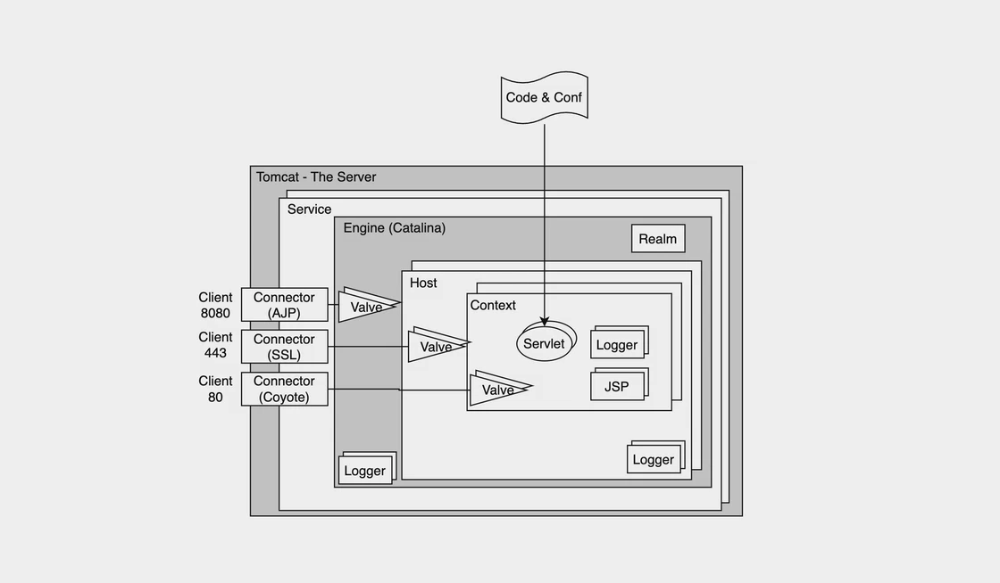

### 1. **Tomcat 서버의 역사와 소개**  
Apache Tomcat은 1999년에 Java 기반 웹 애플리케이션을 실행하기 위해 개발된 **오픈 소스 웹 애플리케이션 서버**입니다. 이 서버는 Java의 표준 사양인 **서블릿(Servlet)**과 **JSP(JavaServer Pages)**를 지원하며, 자바 기반 웹 애플리케이션의 기본 플랫폼으로 널리 사용되고 있습니다.

- **초기 시작**: Tomcat은 자카르타 프로젝트의 일부로 시작되었습니다.
- **지원 기업**: Sun Microsystems(현재 Oracle)의 후원을 받으며 발전했습니다.
- **주요 특징**: 가볍고 빠른 구조로, 복잡한 엔터프라이즈 서버보다 **단순하고 효율적인 아키텍처**를 자랑합니다.
- **사용 용도**: 소규모 및 중형 웹 애플리케이션에 적합하며, Java EE 애플리케이션 서버(예: JBoss, WebLogic)보다 더 단순한 환경을 제공합니다.

### 2. **Tomcat 서버의 구조 개요**
Tomcat은 여러 구성 요소로 이루어져 있으며, 각각의 요소가 독립적으로 요청을 처리하고 웹 애플리케이션의 동작을 제어합니다.

#### **[2.1. Service](./Service.md)**
- Tomcat 서버는 여러 **Service**로 구성될 수 있으며, 각 Service는 클라이언트의 요청을 받아들여 엔진에 전달하고, 응답을 생성하여 다시 클라이언트로 전달하는 역할을 수행합니다.
- **구성 요소**:
  - **Connector**: 클라이언트의 요청을 받아 엔진으로 전달합니다. HTTP 또는 AJP(Apache JServ Protocol)와 같은 프로토콜을 사용합니다.
  - **Engine**: 요청을 분석하고 적절한 웹 애플리케이션에 전달하여 처리합니다.

#### **2.2. [Engine (Catalina)](./Engine.md.md)**
- **Catalina**는 Tomcat의 **핵심 엔진**으로, 서블릿 컨테이너 역할을 수행합니다.
- **주요 기능**:
  - 요청을 분석하고 서블릿 또는 JSP로 요청을 전달하여 결과를 생성합니다.
  - **여러 도메인(Host) 지원**: 하나의 엔진에서 여러 호스트를 지원하여, 같은 서버에서 여러 웹 애플리케이션을 동시에 관리할 수 있습니다.
  
#### **2.3. [Connector](./ApacheConnector/아파치%20톰켓에서%20connector란.md)**
- **Connector**는 클라이언트와 서버 사이의 통신을 담당하며, 다양한 프로토콜(HTTP, AJP 등)을 사용하여 요청을 처리합니다.
- **주요 종류**:
  - **HTTP Connector**: 주로 웹 브라우저와의 통신에 사용되며, HTTP/1.1 및 HTTP/2 프로토콜을 지원합니다.
  - **[AJP Connector](./ApacheConnector/AJP%20(Apache%20JServ%20Protocol)%20Connector.md)**: Apache HTTP 서버와 Tomcat 간의 통신에 사용되며, Apache와의 연동 시 성능 최적화를 제공합니다.

#### **[2.4. Host](./Host.md)**
- Host는 Tomcat 서버에서 **도메인(Host)을 관리하는 구성 요소**입니다.
- 하나의 Tomcat 서버는 여러 Host를 가질 수 있어, **하나의 서버에서 여러 도메인을 동시에 운영**할 수 있습니다.
- 각 Host는 자체적으로 웹 애플리케이션들을 독립적으로 관리하며, 요청을 적절한 애플리케이션으로 전달합니다.
  
#### **[2.5. Context](./Context.md)**
- **Context**는 Tomcat에서 하나의 **웹 애플리케이션을 나타내는 단위**입니다.
- 각 Context는 특정 경로와 관련된 애플리케이션 리소스 및 설정을 포함하며, **하나의 Host 내에서 여러 Context를 가질 수 있습니다**.
- 예: `http://localhost:8080/myapp`에서 `myapp`이 Context로 작동하며, 애플리케이션의 모든 리소스가 이 컨텍스트에 포함됩니다.

### 3. **Tomcat의 주요 구성 요소와 역할**
Tomcat 서버의 구성 요소들은 서로 유기적으로 연결되어 다양한 기능을 제공합니다. 각 요소의 역할은 다음과 같습니다.

#### **3.1. [Realm (보안 관리)](./Realm.md))**
- Realm은 Tomcat의 **인증 및 권한 부여**를 담당합니다.
- 다양한 소스(DB, LDAP, 파일 등)에서 사용자 정보를 가져와 사용자 권한을 관리하며, 클라이언트가 요청한 리소스에 접근할 수 있는 권한이 있는지 확인합니다.
- 예: **JDBCRealm**을 사용하여 데이터베이스에서 사용자 정보와 비밀번호를 확인하고, 인증 및 권한을 부여할 수 있습니다.

#### **3.2. [Valve (요청 처리 과정에서의 추가 작업)](/Valve.md)**
- Valve는 Tomcat의 요청 처리 과정에서 **추가적인 작업**을 수행하는 구성 요소입니다.
- **주요 역할**:
  - 특정 URL 요청을 가로채서 작업을 수행하거나, 특정 IP 주소를 차단합니다.
  - 필터(Filter)와 유사하지만, Tomcat의 내부 구성에 더 깊이 연결되어 있습니다.
- 예: **액세스 로그**를 남기거나, **특정 IP 차단** 등의 작업을 수행합니다.

#### **3.3. Logger (로그 관리)**
- Logger는 **서버의 로그를 기록하고 관리**합니다.
- 각 서비스, 엔진, 호스트, 컨텍스트마다 별도의 로깅 설정을 가질 수 있으며, 이를 통해 Tomcat의 각 구성 요소에서 발생하는 다양한 이벤트를 기록합니다.
- 예: `localhost_access_log` 파일에 HTTP 요청 로그를 남기거나, 서버 오류를 기록하는 에러 로그 생성.

### 4. **Tomcat의 동적 콘텐츠 생성 및 처리**
#### **[4.1. Servlet](./Servlet.md)**
- **서블릿(Servlet)**은 Java로 작성된 **작은 웹 애플리케이션 프로그램**으로, 클라이언트 요청을 처리하고 응답을 생성합니다.
- Tomcat은 **서블릿 컨테이너**로서, 서블릿의 생명주기(초기화, 요청 처리, 종료)를 관리하고, 적절한 서블릿을 호출하여 요청을 처리합니다.
- 주로 **동적인 웹 콘텐츠**를 생성하는 데 사용됩니다.

#### **4.2. JSP (JavaServer Pages)**
- JSP는 HTML과 Java 코드를 결합하여 **동적인 웹 페이지**를 생성하는 서버 측 스크립트 언어입니다.
- Tomcat의 **Jasper 엔진**은 JSP 파일을 **서블릿으로 변환**하여 실행하고, 이를 통해 동적인 페이지를 생성하여 클라이언트에게 전달합니다.
- 예: 데이터베이스에서 조회한 결과를 기반으로 동적인 페이지를 생성하거나, 사용자 입력에 따라 다른 콘텐츠를 표시할 때 사용됩니다.

이러한 Tomcat 서버의 구조는 **확장성**, **유연성**을 제공하여 Java 기반 웹 애플리케이션 개발에 적합한 환경을 구성합니다.

### 톰캣의 전체 구조를 이해하기 쉽게 요약하면

- **Service**: 톰캣의 큰 상자, 여러 가지 요청을 처리하는 공간.
- **Connector**: 입구, 어디서 요청이 왔는지 구분.
- **Engine**: 두뇌, 요청을 어떤 웹사이트로 보낼지 결정.
- **Host**: 웹사이트를 따로따로 관리.
- **Context**: 웹사이트 안에 있는 각각의 애플리케이션.
- **Servlet & JSP**: 요청을 받아서 응답을 만들어주는 작은 프로그램.
- **Realm**: 사용자 로그인과 보안을 담당.
- **Valve**: 특정 요청을 막거나 가로채는 역할.
- **Logger**: 모든 활동을 기록하고 감시.

### 예를 들어 톰캣이 웹사이트를 어떻게 처리하는지?

1. **브라우저**에서 `example.com`을 입력하면, HTTP 요청이 톰캣의 **Connector**를 통해 서버에 도착.
2. 톰캣의 **Engine**은 이 요청이 `example.com`을 위한 것임을 확인하고, 해당 **Host**로 전달.
3. `example.com` Host 내에서 `/myapp`이라는 **Context**를 찾고, 그 안의 **Servlet**을 실행.
4. 서블릿은 요청을 처리하고, 결과를 HTML 페이지로 만들어 **브라우저**에 반환.
5. 모든 요청과 응답 과정은 **Logger**에 기록됨.