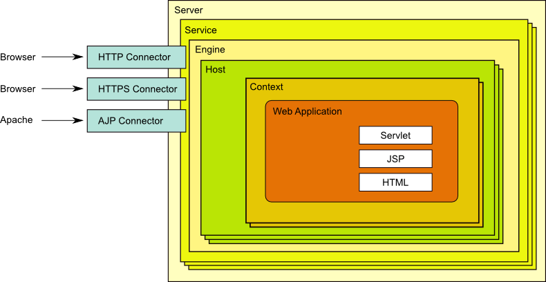
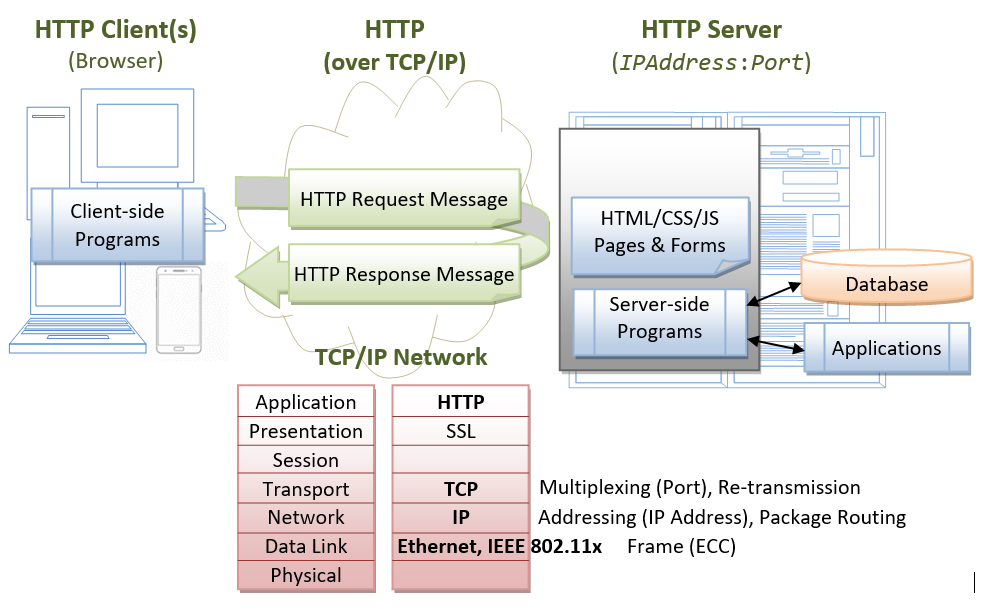
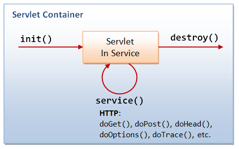

### 1. 서블릿이란?
서블릿(Servlet)은 Java를 사용하여 웹 서버에서 실행되는 서버측 프로그램으로, 주로 클라이언트의 요청을 처리하고 동적인 웹 콘텐츠(HTML, JSON 등)를 생성하는 역할을 수행합니다. 서블릿은 Java EE(Enterprise Edition) 스펙의 일부이며, HTTP 기반의 요청-응답 처리를 위해 만들어졌습니다.

#### HTTP 클라이언트-서버 시스템 아키텍처


#### 서블릿의 주요 기능
- **HTTP 요청 처리**: `HttpServletRequest` 객체를 통해 클라이언트 요청을 분석하고 필요한 데이터를 추출.
- **HTTP 응답 생성**: `HttpServletResponse` 객체를 사용하여 클라이언트로 보낼 응답 생성.
- **서블릿 라이프 사이클 관리**: 서블릿의 생명주기는 `init()`, `service()`, `destroy()` 메소드에 의해 관리됩니다.
  
#### 서블릿의 장점
- **플랫폼 독립성**: Java 기반이므로 다양한 운영체제 및 환경에서 실행 가능.
- **모듈화**: 비즈니스 로직을 분리하여 유지보수 및 확장이 용이.
- **강력한 성능**: 비동기 입출력(NIO) 지원으로 많은 요청을 동시에 처리할 수 있음.

### 2. 서블릿의 라이프 사이클
서블릿 컨테이너가 서블릿의 생명주기를 관리하며, 서블릿은 다음과 같은 단계에 따라 동작합니다:

1. **생성(Initialization)**:
   - 서블릿 클래스가 처음 요청될 때 `init()` 메소드가 호출됩니다.
   - 서블릿 초기화와 관련된 설정을 수행하며, `ServletConfig` 객체를 사용하여 초기화 파라미터를 설정할 수 있습니다.

2. **요청 처리(Request Handling)**:
   - 서블릿이 초기화된 후, 클라이언트 요청이 발생할 때마다 `service()` 메소드가 호출됩니다.
   - `service()` 메소드는 `doGet()`, `doPost()`, `doPut()`, `doDelete()` 등의 메소드로 요청을 분배하여 각 요청 메소드에 맞는 처리를 수행합니다.

3. **종료(Destroy)**:
   - 서블릿이 더 이상 필요하지 않거나 컨테이너가 종료될 때 `destroy()` 메소드가 호출됩니다.
   - 리소스 해제와 같은 정리 작업을 수행합니다.

### 3. 서블릿과 서블릿 컨테이너
- **서블릿(Servlet)**: HTTP 요청을 처리하고 동적인 응답을 생성하기 위한 Java 프로그램.
- **서블릿 컨테이너(Servlet Container)**: 서블릿의 생명주기를 관리하고, 클라이언트의 HTTP 요청을 서블릿에 전달하여 응답을 생성하는 서버 컴포넌트.

#### 서블릿 컨테이너의 주요 기능
1. **요청과 응답 관리**: HTTP 요청을 분석하고, 적절한 서블릿에 분배.
2. **서블릿 생명주기 관리**: 서블릿의 생성, 초기화, 요청 처리, 종료 등 모든 과정 관리.
3. **멀티스레딩 지원**: 동시에 여러 요청을 처리하여 높은 성능을 제공.
4. **보안 관리**: 인증, 권한 검사 등의 보안 기능을 제공합니다.

#### 대표적인 서블릿 컨테이너
- **Apache Tomcat**: 가장 널리 사용되는 서블릿 컨테이너.
- **Jetty**: 경량의 서블릿 컨테이너로, 테스트 및 내장형 서버로 많이 사용.
- **JBoss EAP**: Java EE 스펙을 완전하게 지원하는 엔터프라이즈급 애플리케이션 서버.

### 4. 서블릿 작성 예제: HelloServlet
#### 1. 디렉토리 구조 설정

Apache Tomcat 서버에서 서블릿을 실행하기 위해서는 웹 애플리케이션의 디렉토리 구조를 다음과 같이 설정해야 합니다:

- `<CATALINA_HOME>\webapps\helloservlet`  
  Tomcat의 `webapps` 디렉토리 아래에 `helloservlet` 디렉토리를 생성합니다. `helloservlet`은 해당 웹 애플리케이션의 **컨텍스트 루트**입니다.

- `helloservlet` 아래에 필요한 하위 디렉토리를 생성합니다:
  - `WEB-INF`: 웹 애플리케이션의 설정 및 보안 관련 파일을 저장합니다.
  - `META-INF`: 특정 서버 관련 설정 파일을 보관합니다.
  
- `WEB-INF` 아래에 추가적인 하위 디렉토리 생성:
  - `classes`: 컴파일된 Java 클래스 파일을 저장합니다.
  - `src`: Java 소스 파일을 저장합니다.
  - `lib`: 외부 라이브러리(JAR 파일)를 저장합니다.

최종 디렉토리 구조는 다음과 같습니다:

```
<CATALINA_HOME>
└── webapps
    └── helloservlet
        ├── META-INF
        └── WEB-INF
            ├── classes
            ├── lib
            └── src
                └── mypkg
                    └── HelloServlet.java
```

#### 2. `HelloServlet.java` 작성

`WEB-INF/src/mypkg` 디렉토리에 `HelloServlet.java` 파일을 생성하고, 다음과 같은 코드를 작성합니다:

```java
package mypkg;

import java.io.*;
import jakarta.servlet.*;
import jakarta.servlet.http.*;
import jakarta.servlet.annotation.*;

@WebServlet("/sayhello") // 서블릿 매핑 설정
public class HelloServlet extends HttpServlet {
   @Override
   public void doGet(HttpServletRequest request, HttpServletResponse response)
               throws IOException, ServletException {
      response.setContentType("text/html;charset=UTF-8");
      PrintWriter out = response.getWriter();
      
      try {
         out.println("<!DOCTYPE html>");
         out.println("<html><head>");
         out.println("<meta http-equiv='Content-Type' content='text/html; charset=UTF-8'>");
         out.println("<title>Hello, World</title></head>");
         out.println("<body>");
         out.println("<h1>Hello, world!</h1>");
         out.println("<p>Request URI: " + request.getRequestURI() + "</p>");
         out.println("<p>Protocol: " + request.getProtocol() + "</p>");
         out.println("<p>Remote Address: " + request.getRemoteAddr() + "</p>");
         out.println("<p>A Random Number: <strong>" + Math.random() + "</strong></p>");
         out.println("</body>");
         out.println("</html>");
      } finally {
         out.close();
      }
   }
}
```

#### 코드 설명:
- `HelloServlet`은 `HttpServlet`을 상속받아 `doGet` 메서드를 재정의합니다.
- `@WebServlet("/sayhello")`를 통해 URL `/sayhello`에 이 서블릿이 매핑되도록 설정합니다.
- 브라우저에서 해당 URL에 접근하면 `Hello, world!`와 요청 정보가 포함된 HTML 응답이 반환됩니다.

#### 3. `web.xml` 설정

`WEB-INF` 디렉토리에 `web.xml` 파일을 생성하고 다음과 같이 작성합니다:

```xml
<?xml version="1.0" encoding="ISO-8859-1"?>
<web-app version="3.0"
  xmlns="http://java.sun.com/xml/ns/javaee"
  xmlns:xsi="http://www.w3.org/2001/XMLSchema-instance"
  xsi:schemaLocation="http://java.sun.com/xml/ns/javaee http://java.sun.com/xml/ns/javaee/web-app_3_0.xsd">

  <servlet>
      <servlet-name>HelloWorldServlet</servlet-name>
      <servlet-class>mypkg.HelloServlet</servlet-class>
  </servlet>

  <servlet-mapping>
      <servlet-name>HelloWorldServlet</servlet-name>
      <url-pattern>/sayhello</url-pattern>
  </servlet-mapping>
</web-app>
```

##### `web.xml` 설명:
- `servlet` 태그: `HelloWorldServlet`이라는 이름의 서블릿을 정의하고, 해당 서블릿의 클래스가 `mypkg.HelloServlet`임을 지정합니다.
- `servlet-mapping` 태그: `HelloWorldServlet` 서블릿을 `/sayhello` URL 패턴에 매핑합니다.
- 결과적으로, 브라우저에서 `http://hostname:port/helloservlet/sayhello` URL을 호출하면 `HelloServlet`이 실행됩니다.

#### 4. 컴파일 및 배포

1. **소스 파일 컴파일**: `WEB-INF/src/mypkg/HelloServlet.java` 파일을 컴파일하여 `WEB-INF/classes/mypkg/` 디렉토리에 `.class` 파일을 생성합니다.
   
   ```bash
   javac -d <CATALINA_HOME>/webapps/helloservlet/WEB-INF/classes <CATALINA_HOME>/webapps/helloservlet/WEB-INF/src/mypkg/HelloServlet.java
   ```

2. **Tomcat 서버 시작**: Tomcat 서버를 시작하고 브라우저에서 다음 URL에 접속합니다.

   ```
   http://localhost:8080/helloservlet/sayhello
   ```

3. **결과 확인**: 위 URL에 접속하면 "Hello, world!"와 함께 요청 URI, 프로토콜, 클라이언트 IP 주소 등이 출력된 HTML 페이지가 나타납니다.

이와 같이 `HelloServlet`을 작성하고 배포하면 톰캣을 통해 자바 서블릿이 올바르게 실행되는지 확인할 수 있습니다.


### 5. 서블릿 컨테이너에서의 실행
1. **Tomcat 설치**: Apache Tomcat 서버를 설치하고 실행.
2. **HelloServlet 배포**: Tomcat `webapps` 디렉토리 아래 `helloservlet` 디렉토리를 생성하고, `WEB-INF` 및 `META-INF` 디렉토리를 구성.
3. **웹 브라우저 테스트**: `http://localhost:8080/helloservlet/sayhello`로 접근하여 서블릿이 동작하는지 확인.

### 6. 서블릿과 Spring MVC
서블릿을 직접 사용하는 것보다, 많은 경우 Spring MVC와 같은 프레임워크를 사용하여 더 구조적이고 유지보수하기 쉬운 웹 애플리케이션을 작성할 수 있습니다. Spring MVC의 주요 컴포넌트인 `DispatcherServlet`은 모든 HTTP 요청을 중앙 집중식으로 관리하고, 요청을 각 컨트롤러로 전달하여 비즈니스 로직을 수행하도록 돕습니다.

---

위 내용을 보강하여 서블릿과 서블릿 컨테이너에 대한 개념, 라이프 사이클, 실습 예제 및 스프링과의 통합 개념을 전체적으로 이해할 수 있도록 작성하였습니다. 추가적으로 보강할 내용이 있거나 특정 항목을 더 깊이 다루길 원하시면 말씀해 주세요!